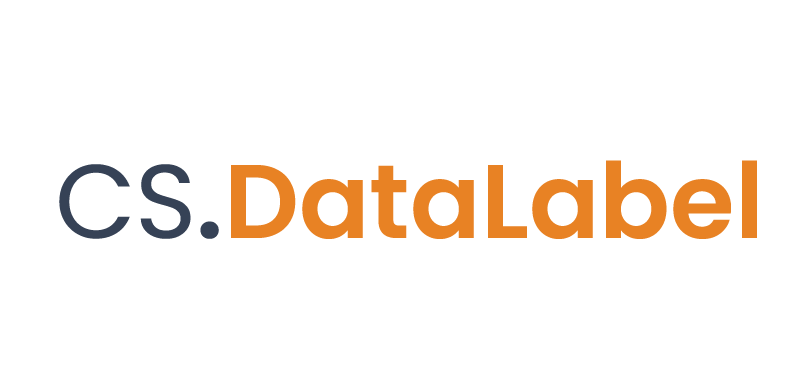

# Overview

## **Data Annotation Platform for AI Training**

**CS.DataLabel** is one of the most comprehensive data annotation platforms. It supports the labeling of various data types with multi-labeled outputs formats for AI model training. 

It enables the labeling of raw data imported from the data source. The labeled data with specific output formats can then channel into training environments for supervised / semi-supervised learning. This shows how CS.DataLabel fits in machine learning workflows. 

**Data labeling tasks are challenging due to a few factors:**

* Long hours of the human workforce to label the data manually
* Off-the-shelves toolkit which cannot fulfill the use cases needs
* Frustration processes to convert data to supported format types for labeling work

We aim to solve these problems in CS.DataLabel to provide significant value to the machine learning workflow. 

CS.DataLabel is one of the unique modules of Skymind CreatorSuite.AI  


**Check out:** [CS.DataLabel](https://creatorsuite.ai/cs-datalabel/) and [Skymind](https://skymind.global/)


## Features

* **Platform-agnostic**
  * CS.DataLabel is built with Java backend. As Java is platform-neutral, it is as simple as download the CS.DataLabel Uber Jar file and run it with Java runtime.
* **Asynchronous API** - Fast and speedy response In-memory Java-based database
* **In memory Java-based database**
* **Conversion of conventional data types to preferred formats** \(For example: .pdf format to .png format\)
* **Multi data types supported**

| Image | Document | Video | Tabular | Voice |
| :--- | :--- | :--- | :--- | :--- |
| jpg, JPEG, JPG | pdf | Coming soon... | Coming soon... | Coming soon... |
| png, PNG |  |  |  |  |
| tif, tiff |  |  |  |  |
| bmp |  |  |  |  |
| webp |  |  |  |  |

* \[Working in progress. Stay tune with these features coming up below\]
  * **AI in the Loop** - **Deep Learning assistant** for labeling tasks to reclaim valuable time for meaningful ML/DL tasks
  * Support labeling of more data types - **video, tabular, and voice data**
  * **Data management**

## Strengths of the tool

* Scale data labeling operations to a massive real-world dataset 
* Cut costly data labeling services
* Aesthetic and intuitive UI interface, to make the work fun to do!
* Reclaim valuable time from inefficient data labeling, the technical team can focus on more meaningful ML/DL tasks.

