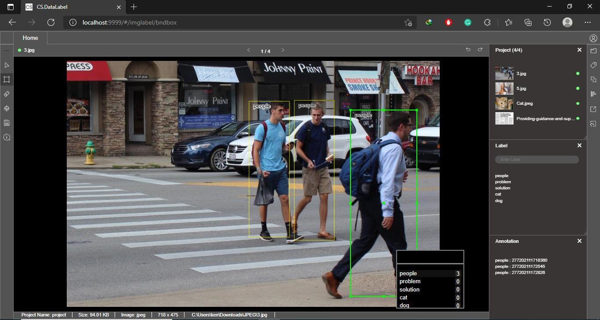
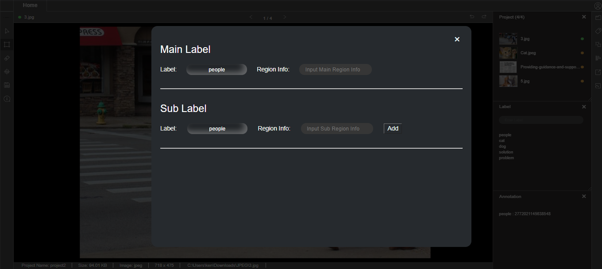
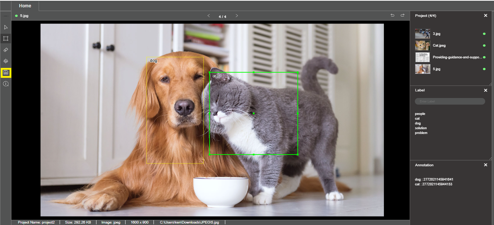
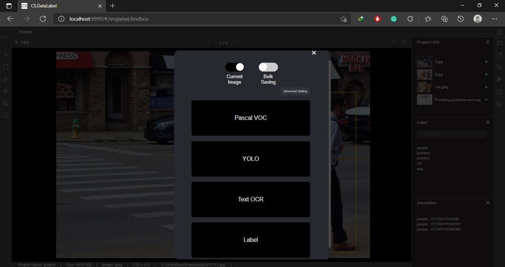

# Annotation For Different Use Cases

CS.DataLabel support various labelling methods for different use cases.

### Image Classification Labelling Method:

Draw a bounding box and select a label created from label list

### Text Recognition Labelling Method:

Draw a bounding box and insert text into the blank label column

Create sub-labels if necessary.

### **Export of Labels**

Annotation output has to be exported for latter process. The types of saved output format depends on the supported formats to train the labelled data with.

Click on the file saving button to select types of output saving format.

### Bounding Box Annotation

* Pascal VOC
* YOLO
* Text OCR
* Label

Note: The option of saving label for current data point or the whole dataset is available for bounding box annotation.

### Segmentation Annotation

* COCO
* JSON
* Label

