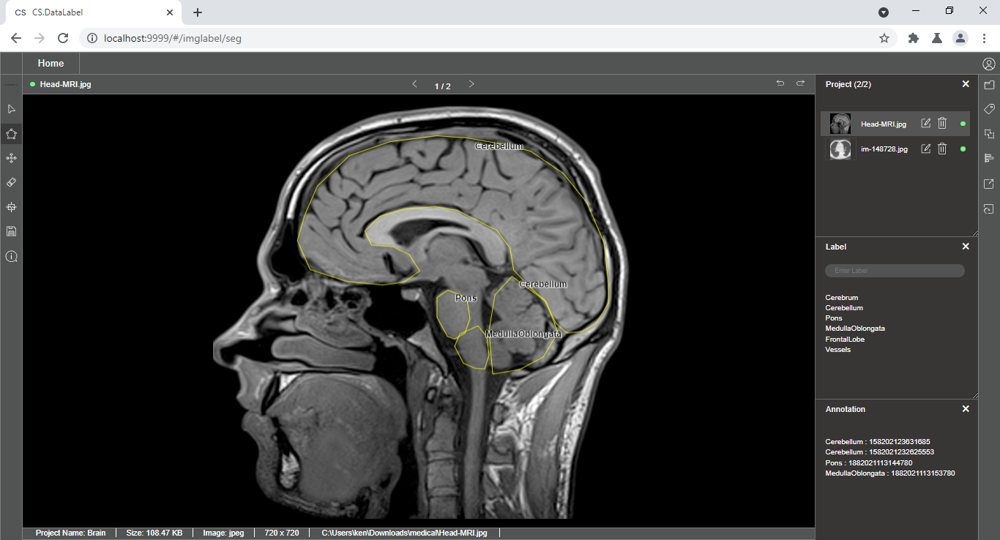
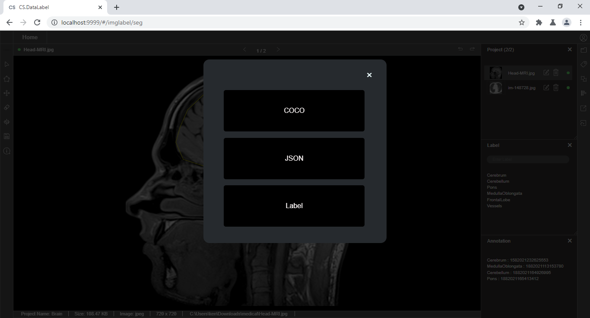

# Annotation For Different Use Cases

CS.DataLabel supports various labeling methods for different use cases.

## Image Classification Labelling Method

Draw a bounding box around an object and select a label for the object from the label list

## Text Recognition Labelling Method

Draw a bounding box around the text and insert the label into the blank label column

## **Segmentation labeling method**

Draw a polygon around an object and assign a label for the object from the label list

Create sub-labels for the current object if necessary by double-clicking the selected region

## **Export of Labels**

Annotation output has to be exported for the later process ****such as machine learning and deep learning. The types of saved output format depend on the supported formats to train the labeled data with. CS.DataLabel supports several output formats.

Click on the Save button to select the type of output format

## Bounding Box Annotation Output Format


Note: The option of saving label for current data point or the whole dataset is available for bounding box annotation


### Segmentation Annotation Output Format

