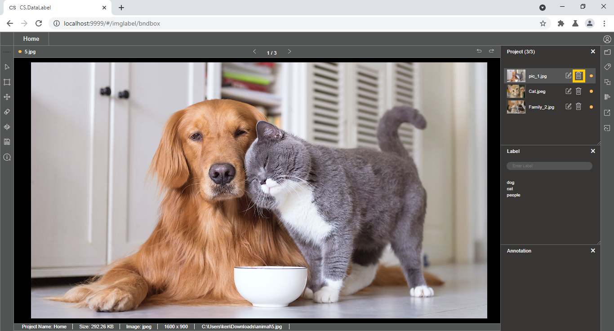

# Delete Image

Users can remove the unwanted image in the current project via deleting the image from the image list of the project file side menu


CS.DataLabel automatically made a backup folder \(.classifai\_deleted\_data\) for users who may want to recover back the deleted image. However, please proceed with care when deleting images


