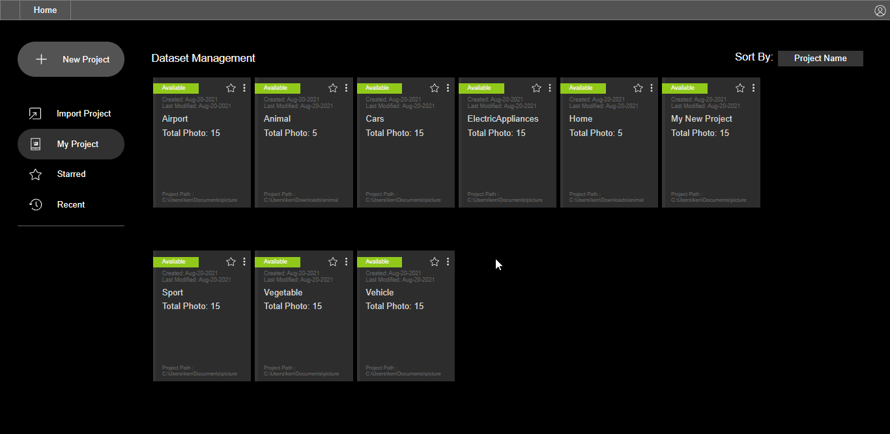

# Deletion of Projects

## Deletion of Projects:

The unused project can be deleted with a few clicks in the home directory


**Note:** The deleted project will be removed from the database. It is unlikely to reverse the action. Please proceed with care.


