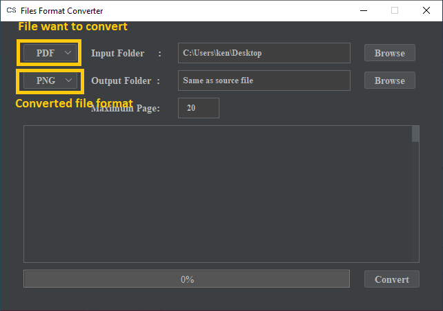
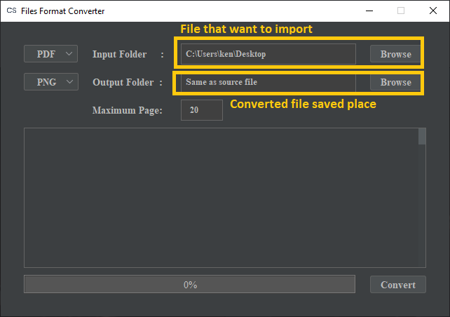
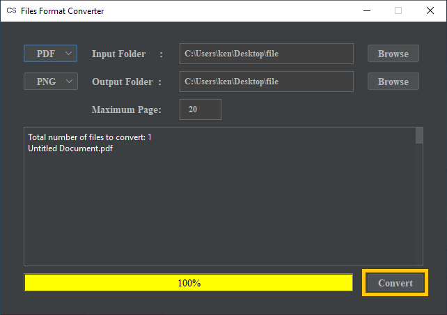

# Files Conversion

CS.DataLabel supports files conversion to ease the users in labeling data in formats suitable for AI modeling. 

The motivation of this is there are formats that are not commonly used for data ingestion such as document formats \(doc, docx, pdf\) or image formats with more than 3 color channels \(tif, tiff\).

### 1.0 Supported File Format

The file formats below are supported for the conversion. Users can choose accordingly from each category for the conversion of file format from one type to another.

#### File Format to Convert From

1. PDF
2. TIF

#### File Format to Convert To

1. JPG
2. PNG

CS.DataLabel team will continue to support more file types based on demands.

### 2.0 Files Conversion Guideline

**Step 1:** Run CS.DataLabel and click the medium button.

**Step 2:** On the top left side, select ****the file format of the files that the users want to change ****from the selection field beside the input folder. Then, select the output format of the files that the users want to convert to from the selection field beside the output folder

The maximum number of files that can be converted in a single conversion is 20 pages

**Step 3:** On the top right side, click the browser button to select the path of the input folder that contains the files to be converted.

Keep the output folder as "Same as source file" to save the files back to the original path. Alternatively, click on the second browser button to choose the path of the output folder to save the newly converted files.

**Step 4:** Finally, click on the convert button in the bottom right corner. The progress bar will show 100% when the files were successfully converted. Check the file names converted in the text panel. 

The Files Format Converter can be closed once the conversion is complete.

**Step 5:** Go to the Output folder location can check the file that had been converted.

