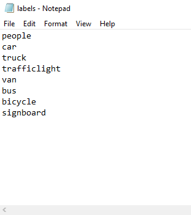

# Labels Import/Export

## Benefits of the Labels Import/Export Feature:

1. Labels of images can be exported in different file formats such as **YOLO, Pascal VOC, text OCR, and text label**
2. Users can create their custom label list in a text file to be imported into the project for use in annotation
3. The exported label text file can be reimported into the project for usage, this speed up the labeling work task of similar kind of projects
4. Users can perform any kind of AI project at ease with the output from CS.DataLabel customizable labeling tool
5. Users can choose to export the preferred file format for the current labeled image or all labeled images \(bulk saving\)

### Method

### How to Create a Custom Label List file

Each label are separated with a new line in the text file

### How to Export Label File:

Click the save button on the annotation page and choose the label option to export the image labels of a project. The exported label file will be located in the dataset folder

### How to Import Label File:

Import the label text file to use the created label list in the annotation project

