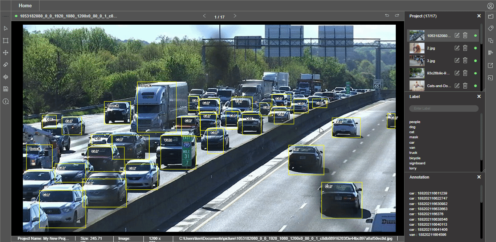
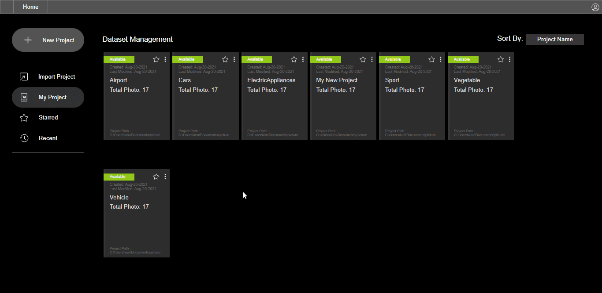

# Project Import/Export

A project can be imported into CS.DataLabel using a configuration file in **JSON format**. The project configuration file contains the metadata of a project


**The configuration file of a project comes from the export feature of CS.DataLabel** **tool.**


### Benefits of the Import/Export Feature:

1. Visual cross-validation on image labeling quality
2. Reimport project to adjust, remove or add labels to reannotate the undesired labeled images
3. Reimport project to output user-preferred label formats such as YOLO and Pascal VOC
4. Customizable image annotation for different projects
5. Flexible collaboration between labeler and engineer
6. All images annotation data will be updated and saved to the Classifai database, this prevents the user from losing valuable labeled images data and time

### Methods:

### How to Export Project Configuration File:

The project can be exported in two options.

1. **Config file:** Save a JSON format file into the project folder.
2. **Zip File \(with data\):** Save all the images together with the project JSON file into one zip file.

### How to Import Project Configuration File:

Import by selecting the configuration file in JSON format.

