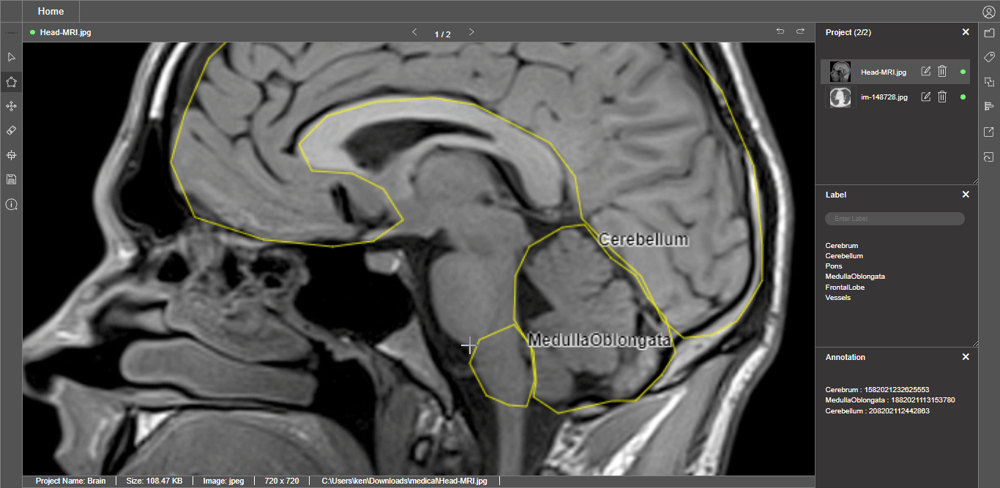

# Segmentation Techniques Breakdown

## Autocomplete the polygon 

When annotating the object of interest with polygon lines by making points around it, it is easy to finish the final line to join it by clicking the **enter key.** Using this style will speed up the annotation process

## Undo the wrongly annotate point of the polygon

Users can use the **backspace** **key** to remove the unwanted polygon points and continue back to annotate the current object

## Remove all the polygon point

When users do not satisfy with the current polygon points on the object, using the **escape key** is a quick way to remove all current annotated polygon points

## Delete the Polygon of An Object

Users can use the annotation tool to **select** a particular polygon of an object and remove it using the **delete or backspace key** 

