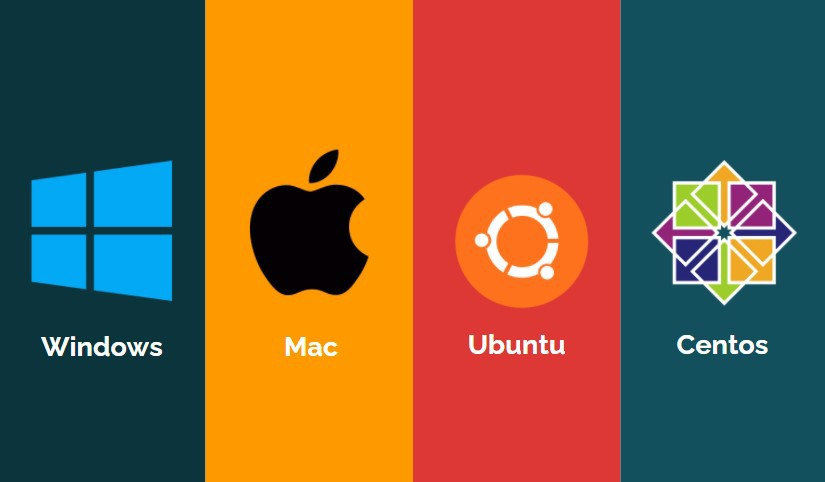

# Installation

## **Install Classifai**

Classifai supports the following operating systems \(OS\).

Installation comes in distribution built with Java for each operating system.

The versions supported for each OS and installation package format are listed below. Select accordingly to download the installation package.

| Operating System | Supported Version | Installation | Package | Format |
| :--- | :--- | :--- | :--- | :--- |
| [Windows](https://bit.ly/3xMayat) | 7, 8, 10 | msi |  |  |
| [Mac](https://bit.ly/3zObcpJ) | 10 | pkg |  |  |
| Ubuntu | [18 LTS](https://bit.ly/3gJZPY7), [20 LTS](https://bit.ly/3gSgd7Y) | deb |  |  |
| Centos | [7](https://bit.ly/3gJ7S7J), [8](https://bit.ly/3xUmOWv) | rpm |  |  |


Uberjar file: [Here](https://bit.ly/3xHTpP6)








