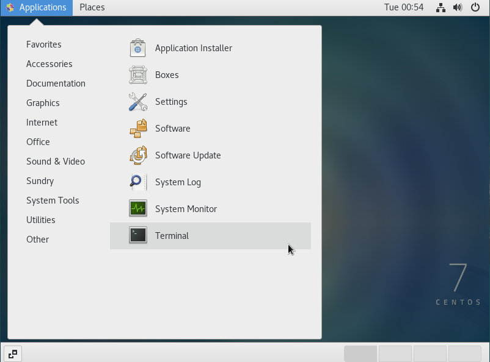
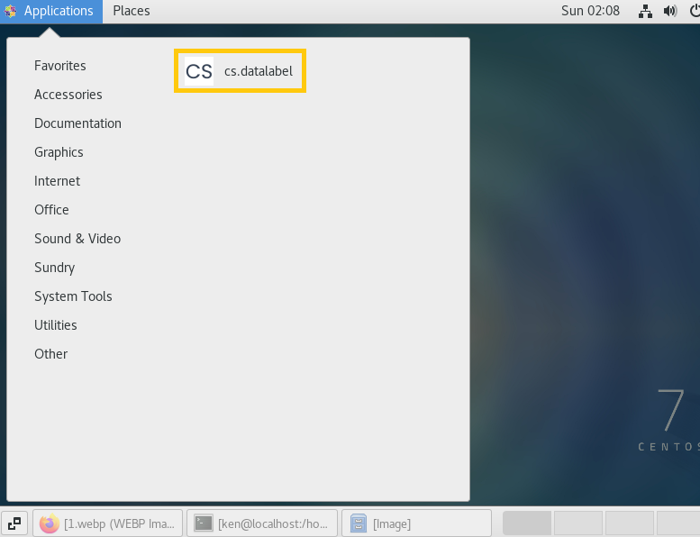
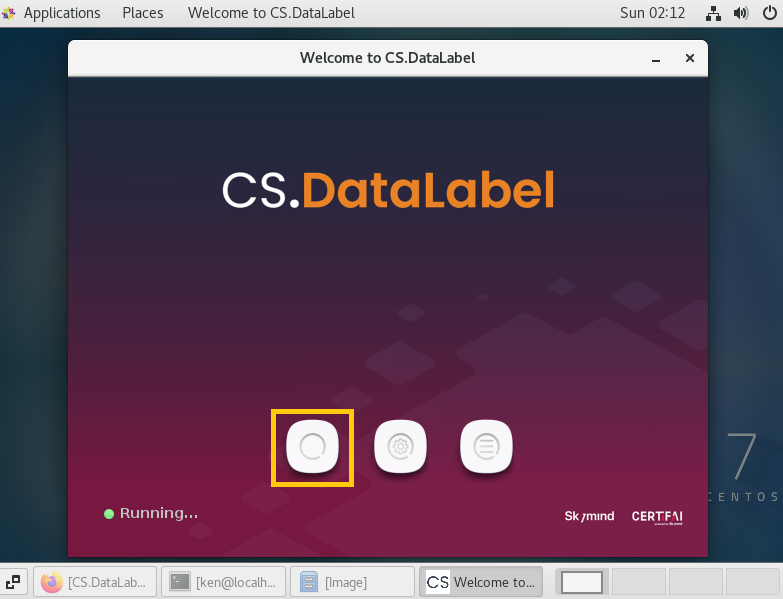
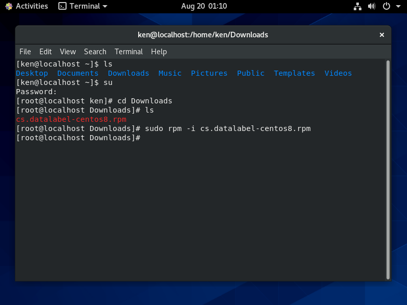

# Installation on Centos

## Installation for CentOS 7

For CentOS 7, users have to install CS.DataLabel by using the terminal.


Using GUI is not recommended because the installation might not run successfully. Don't worry,  the installation using the terminal will just take a few steps to complete. 


**Step 1:** Download CS.DataLabel installer **.rpm file** compatible with CentOS 7 from the installation page

**Step 2:** Open the terminal and make sure the user account is the **root account** using the command below



```text
su
```

**Step 3:**  Go to the downloaded file location by command code

```text
cd {installer_location}
```

**Step 4:** Type the following command code to install Classifai

```text
 sudo rpm -i {package_file.rpm}
```


**Step 5:** Running CS.DataLabel on CentOS7 by double-clicking the CS.DataLabel Icon in the Applications



Click the button to open CS.DataLabel or alternatively go to[ http://localhost:9999/](http://localhost:9999/) at the browser



## Installation for CentOS 8

Users can install CS.DataLabel on CentOS 8 by using terminal

### Installation using Terminal

**Step 1:** Before login to the centos account, make sure CentOS8 **supported** **X11 server**. Users can click the setting icon and choose Standard on Xorg.


**Step 2:** Download CS.DataLabel installer **.rpm file** compatible with CentOS 8 from the installation page

**Step 3:** Open the terminal and navigate to the downloaded path using the commands below

```text
 cd {installer_location}
```

**Step 4:** Make sure the user account is the **root account** using the command below

```text
su 
```

**Step 5:** Type the following command code to install CS.DataLabel

```text
sudo rpm -i {package_file.rpm}
```



### Running of CS.DataLabel on CentOS8

First, click Activities and select Show All Applications to find the CS.DataLabel program


Run CS.DataLabel by double-clicking on the CS.DataLabel icon. Click the button to open CS.DataLabel or go to [http://localhost:9999/ ](http://localhost:9999/)at the browser




