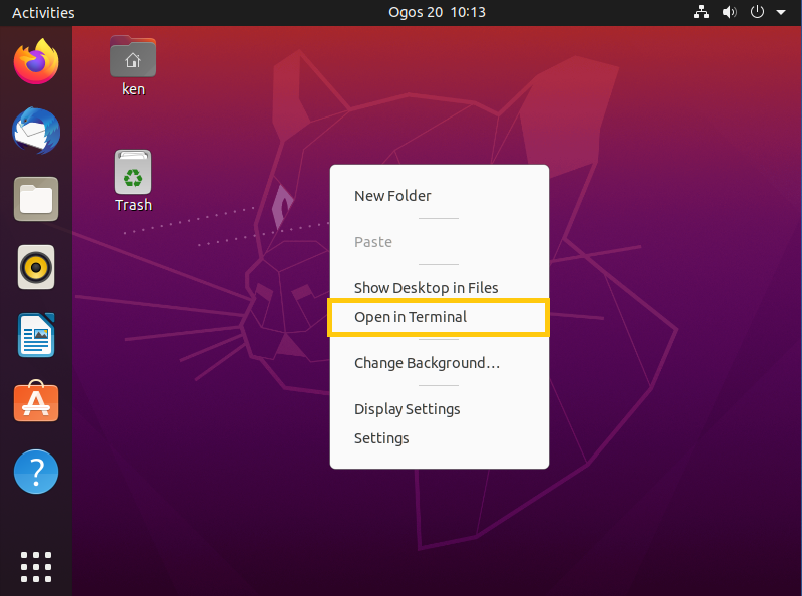

# Installation on Ubuntu

These are 2 methods to install CS.DataLabel in Ubuntu

For those who are familiar with the terminal, users can use **method 1.**

For those users who are familiar with using Software Installer \(GUI\), go for **method 2**.

## Method 1: Installation using Terminal

**Step 1:** Download CS.DataLabel installer .deb file from the installation page.

Choose the operating system according to operating system Ubuntu 18 LTS or 20 LTS.

**Step 2:** Right-click to open the terminal and navigate to the downloaded file path.



```text
cd {downloaded_path}
```

**Step 3:** Type the following command code to install CS.DataLabel.

```text
sudo dpkg -i package_file.deb
```



If users encounter an error stated that dpkg frontend lock is locked by another process, follow the steps as shown in the figure below. The continue with the installation steps above.



## Method 2: Installation using Software Installer

**Step 1:** Download CS.DataLabel installer .deb file from the installation page.

Choose the operating system according to operating system Ubuntu 18 LTS or 20 LTS.

**Step 2:** Double click on the installer. Click install and wait for the installation to complete.

## Running of CS.DataLabel on Ubuntu

After installation is completed, open CS.DataLabel by double-clicking on the CS.DataLabel icon in the Application or go to [http://localhost:9999/](http://localhost:9999/) at the browser




