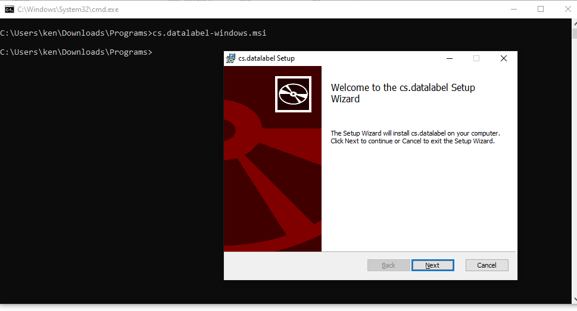

# Installation on Windows

**Step 1:** Download CS.DataLabel installer .msi file from the installation page

**Step 2:** Click installer .msi file to install CS.DataLabel. Follow the instructions to go through the steps.


If the security warning window appears, click **run** to start the installation


Follow the instruction to go through the steps

**Step 3:** Wait till the installation is completed.

**Step 4:** You will see CS.DataLabel icon on the desktop. Double click on it to start running CS.DataLabel and click the button to open the browser or go to [http://localhost:9999/](http://localhost:9999/) at the browser


**Note:** The Installation package might fail to run if the computer was installed with an antivirus program. If so, run the msi file from Command Prompt / PowerShell \(run with administrator mode\) as shown in the diagram below


Proceed with the installation until finish



