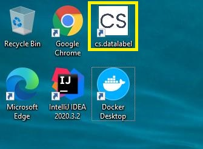
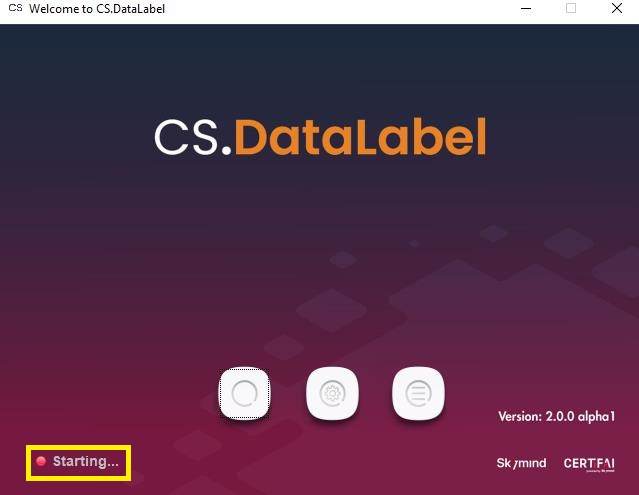
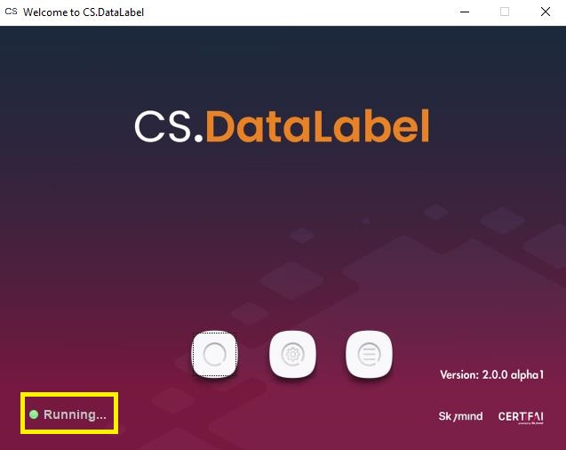
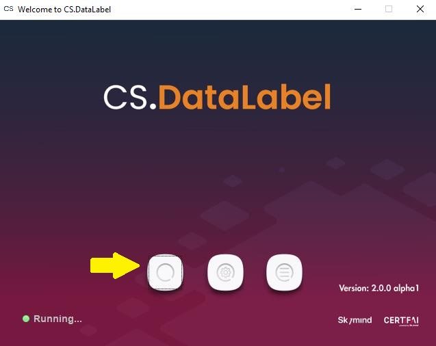

# Quickstart

After CS.DataLabel is installed, run it by clicking on the shortcut icon from respective operating system.

Once CS.DataLabel is booted, Welcome Launcher will be launch. The server status will be displayed on the bottom left corner.

Once the server status message displayed "Running", CS.DataLabel is booted up successfully.

There are two ways to open CS.DataLabel in the browser

* Click on the first button of **Welcome Launcher**

Alternatively, proceed to open a supported browser \(Chrome, Firefox, or any Chromium- based browser\) and go to url _http://localhost:9999/_

* Alternatively, proceed to open a supported browser \(Chrome, Firefox, or any Chromium- based browser\) and go to url _http://localhost:9999/_

