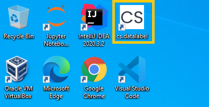

# Quickstart

After CS.DataLabel is installed, run it by clicking on the shortcut icon 

Once CS.DataLabel is booted, Welcome Launcher will initiate. The server status will be displayed at the bottom left corner.

Once the server status message displayed "Running", CS.DataLabel is booted up successfully.


There are **two ways** to open CS.DataLabel in the browser


* Click on the first button of **Welcome Launcher**

* Alternatively, proceed to open a supported browser \(Chrome, Firefox, or any Chromium-based browser\) and go to URL [_http://localhost:9999/_](http://localhost:9999/)\_\_

