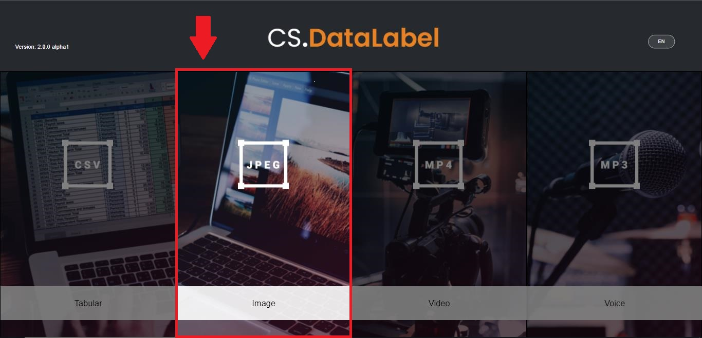
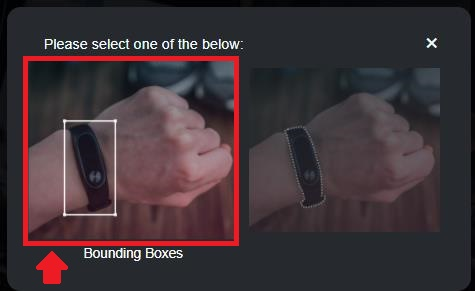
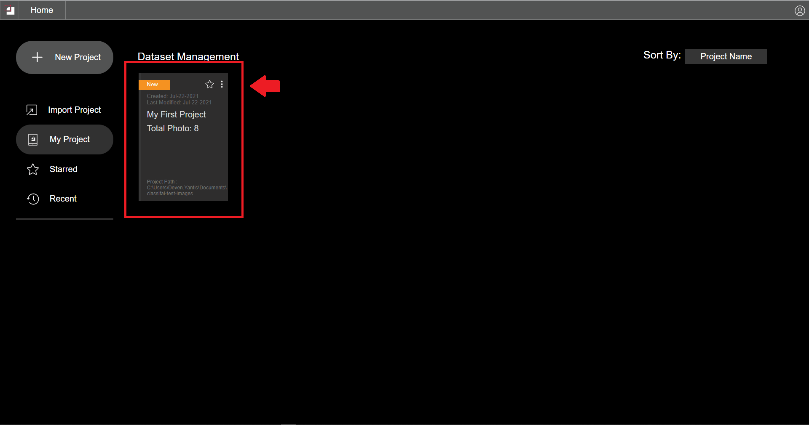

# Create Project

## Prerequisite

Before creating a project, you need to have a dataset folder. This folder should contain data points for the project. Example below shows a dataset folder containing images.

### Accepted dataset folder structure

All data point in the root folder

```text
 .
 ├── hat_194.jpeg
 ├── hat_195.jpg
 ├── hat_196.jpg
 ├── hat_197.jpg
 ├── hat_198.jpg
 ├── hat_199.jpg
```

Data in separated in child folder

```text
 .
 ├── 001.jpg
 ├── 002.jpg
 ├── 003.jpg
 ├── sedan
 │   ├── sedan_001.jpg 7 
 │   ├── sedan_002.jpg 8 
 │   └── sedan_003.jpg
 ├── small
 │   └── small_001.jpg
 └── 004.JPG
```


When saving annotation labels, the image path will follow the directory structure. Make sure to structure your data as intended for training.


## How to create project

This tutorial shows how to create a bounding box project.

#### 1. Click start CS.DataLabel


#### **2. Choose image**



#### **3. Choose bounding box**



#### **4. Click new project**



Label file can be uploaded to the project. Label file must be in text \(.txt\). Each labels are separated by new line.


Label file can be uploaded to the project. Label file must be in text \(.txt\). Each labels are separated by new line.

#### **5. Enter project name and choose project folder. Project folder is the folder of dataset**


Label file can be uploaded to the project. Label file must be in text \(.txt\). Each labels are separated by new line.



#### **6. Project successfully created. Double click project card to open**



