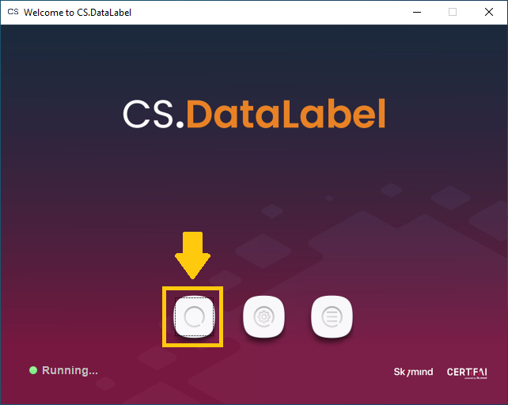
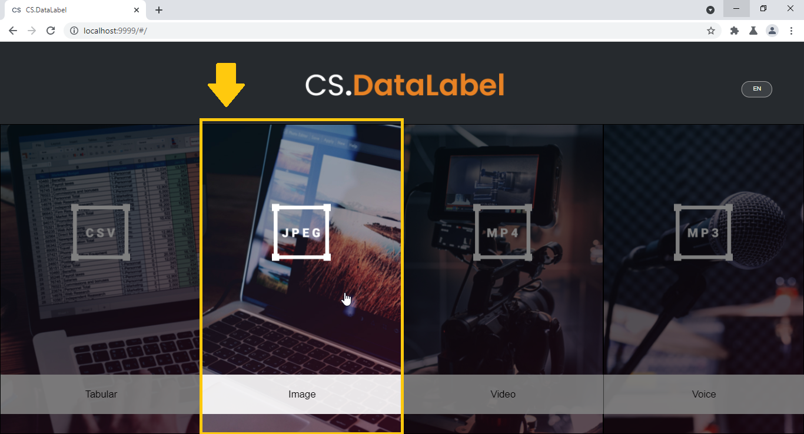
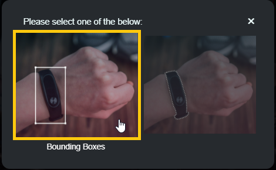
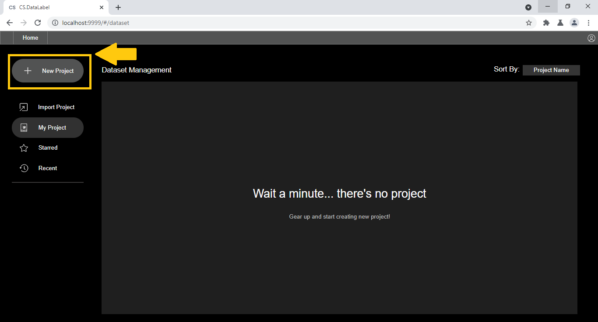
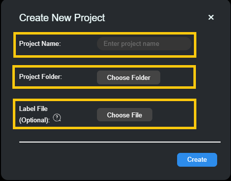
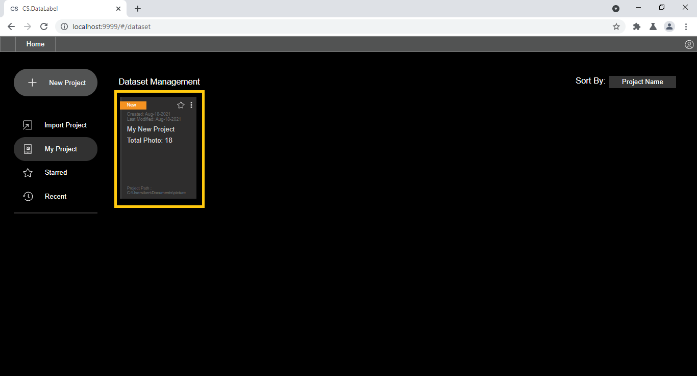

# Create Project

## Prerequisite

Before creating a project you need to have a dataset folder. This folder should contain data points for the project. The example below shows the dataset folder containing images

### Accepted dataset folder structure

All data points in the root folder

```text
 .
 ├── hat_194.jpeg
 ├── hat_195.jpg
 ├── hat_196.jpg
 ├── hat_197.jpg
 ├── hat_198.jpg
 ├── hat_199.jpg
```

Data points in the separated child folder

```text
 .
 ├── 001.jpg
 ├── 002.jpg
 ├── 003.jpg
 ├── sedan
 │   ├── sedan_001.jpg 7 
 │   ├── sedan_002.jpg 8 
 │   └── sedan_003.jpg
 ├── small
 │   └── small_001.jpg
 └── 004.JPG
```


When saving annotation labels, the image path will follow the directory structure. Make sure to structure your data as intended for training.


## How to create a project

This tutorial shows how to create a bounding box project in CS.DataLabel

#### 1. Click the button start CS.DataLabel



#### **2. Choose Image Annotation**



#### **3. Choose bounding box**



#### **4. Click new project**



#### **5. Enter a project name and choose the project folder** 

The project folder is the folder containing the image dataset


Label file can be uploaded to the project to use in the annotation. Label file must be in text file \(.txt\). Each label is separated by a new line.




#### **6. Project successfully created. Double click project card to open**



