# Tailor Workstyle and Make Good Use of Tools

### 1. Pointer tool

Users can utilize the pointer tool to zoom in and out the current image by scrolling the mouse wheel or move the image around to have a good inspection of the object of interest for later annotation

### 2. Switching images

Users can switch to the image of interest by clicking the thumbnails of the project files side menu or using the left and right arrow key 

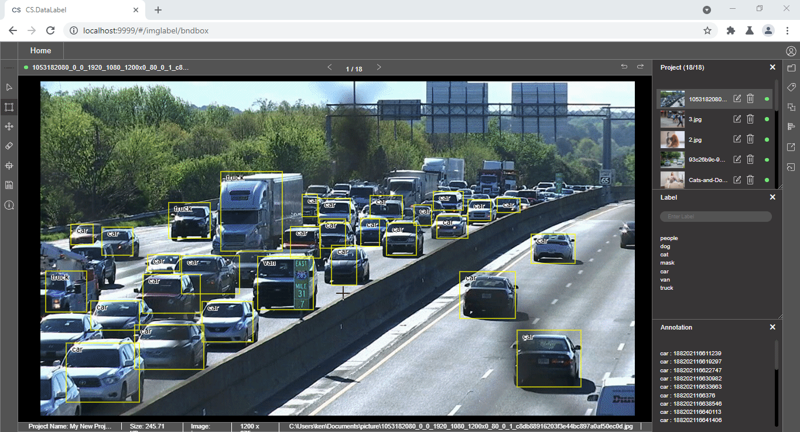

### 3. Create space for doing annotation work

When users want to focus on doing detailed annotation on the current image, close the side menu could create more space for the environment 

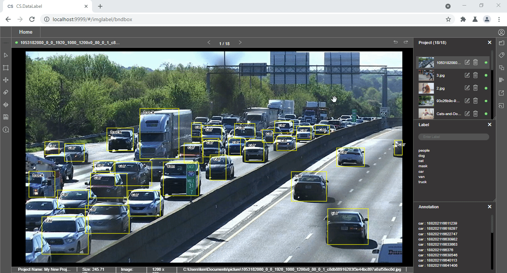

### 4. Side menus

Side menus such as project files, label, and annotation provide respective information of the current project. Users may open certain side menus for their preference 

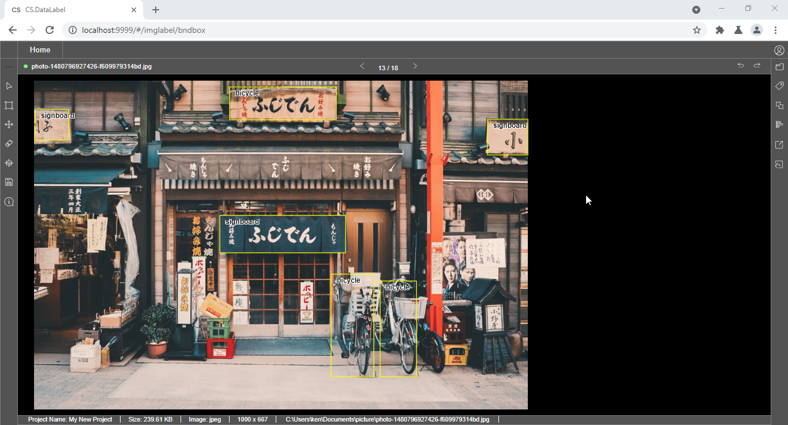

**Project files:** this side menu shows the thumbnails of all the project files in the dataset folder

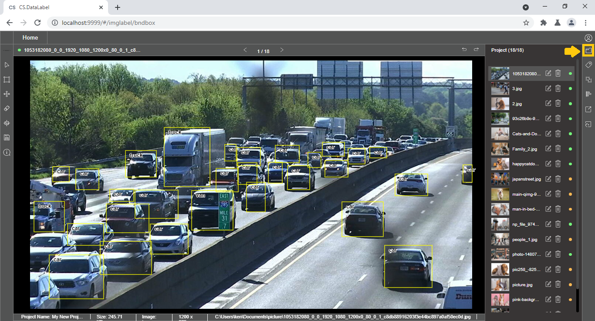

**Label:** this side menu shows a list of labels that can be used to annotate the objects of the image

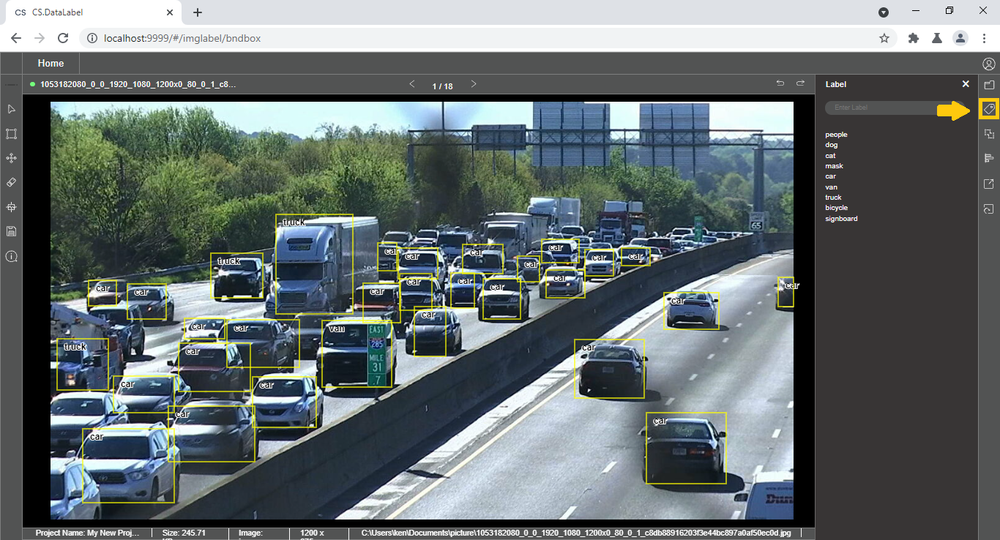

An **input box** is provided for users to input labels for annotation. Labels can also be **imported** into the project. Users can **remove** the unwanted label from the label list, note that the annotation tool must be selected. The steps are displayed in the gif below


It is advised that users make sure all the required labels have been inputted before performing annotation work


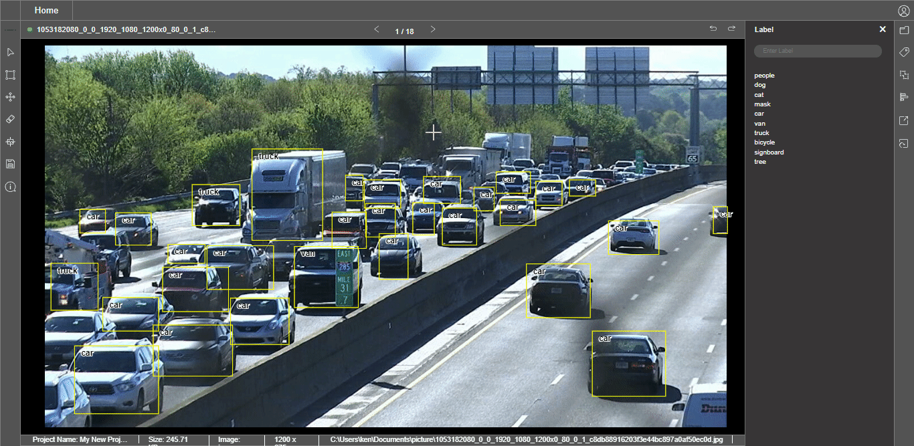

**Annotation:** this side menu ****display the annotations of the objects that have been made on the current image

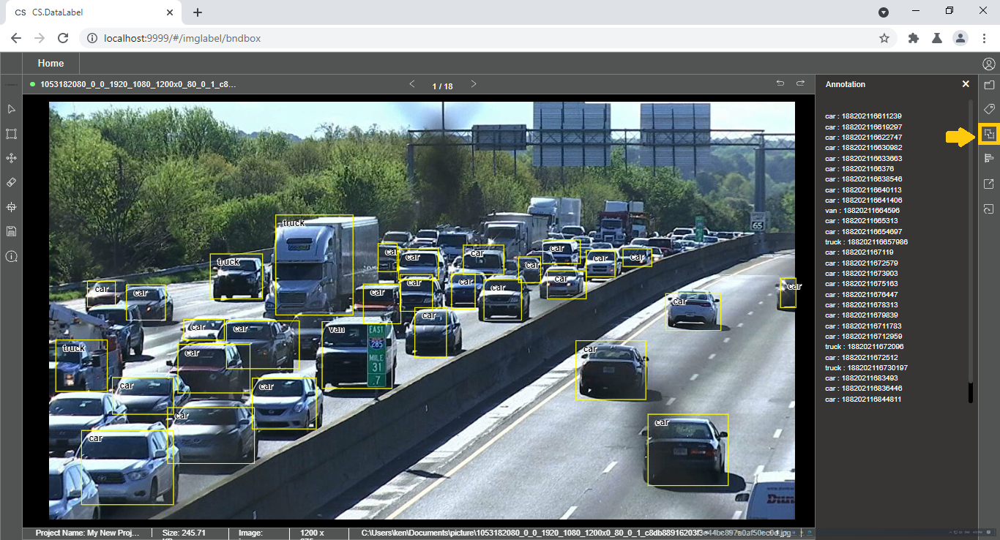

### 5. Using the cross guided line tool

Having a cross guiding line will help in visual positioning the annotation on the object

### 6. Change label using the label list

When users accidentally select the wrong label for the current object, users can change to the correct label using the label list side menu

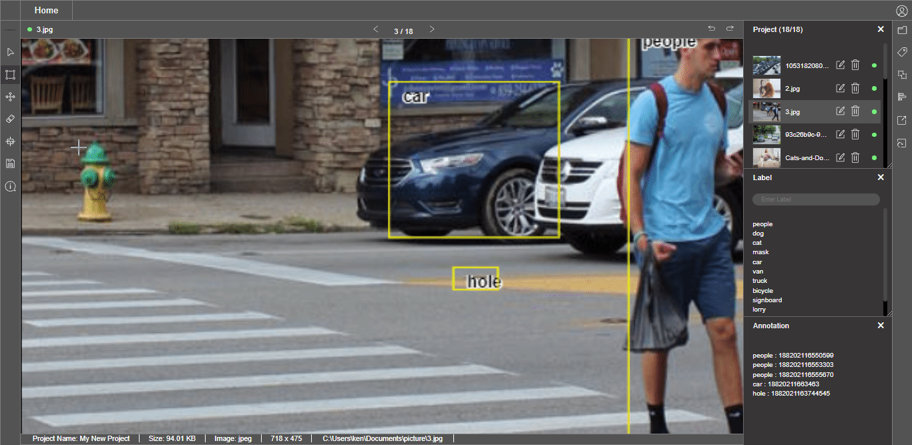

Alternatively, double click on the object, a pop-up window will appear and change the label of the object from the selection of the main labels

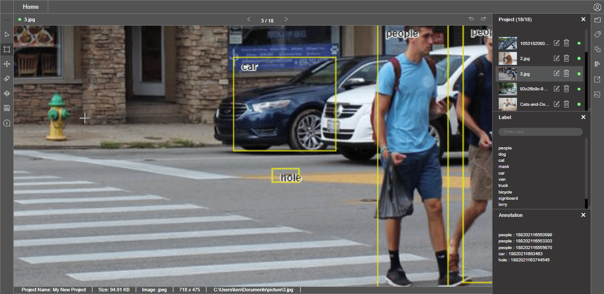

### 7. Using the annotation tool

The annotation tool is important in both the bounding box and segmentation project. Its functions are as follows:

* **Drawing bounding box or polygon points around an object** 
* **Click to select a particular bounding box or polygon of an object**
* **Making adjustments to the selected bounding box or polygon of an object**
* **Select and delete a particular bounding box or polygon of an object**

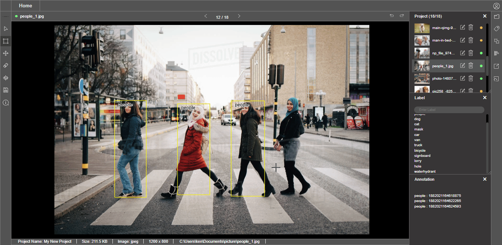

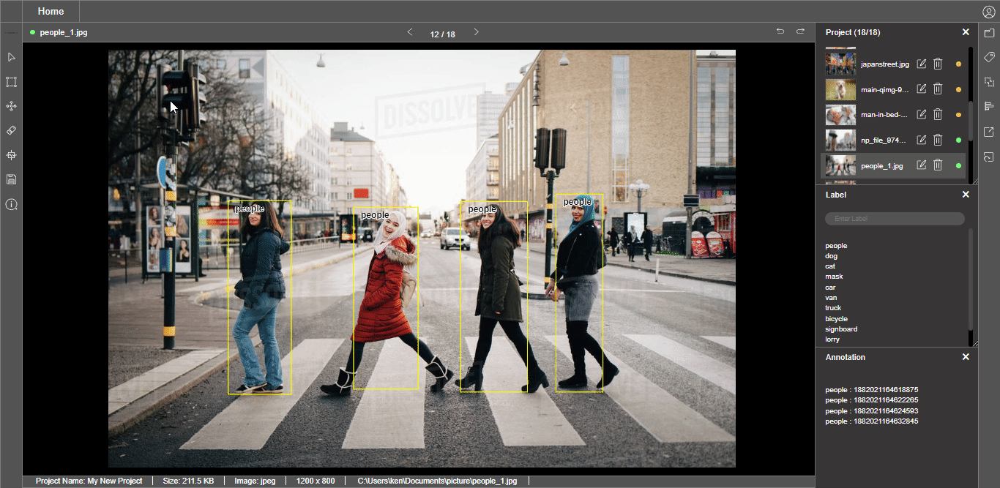

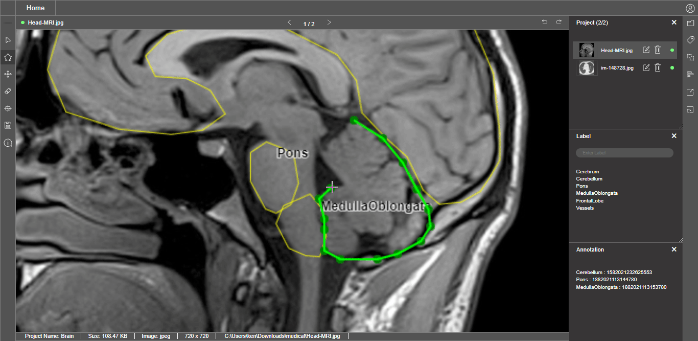

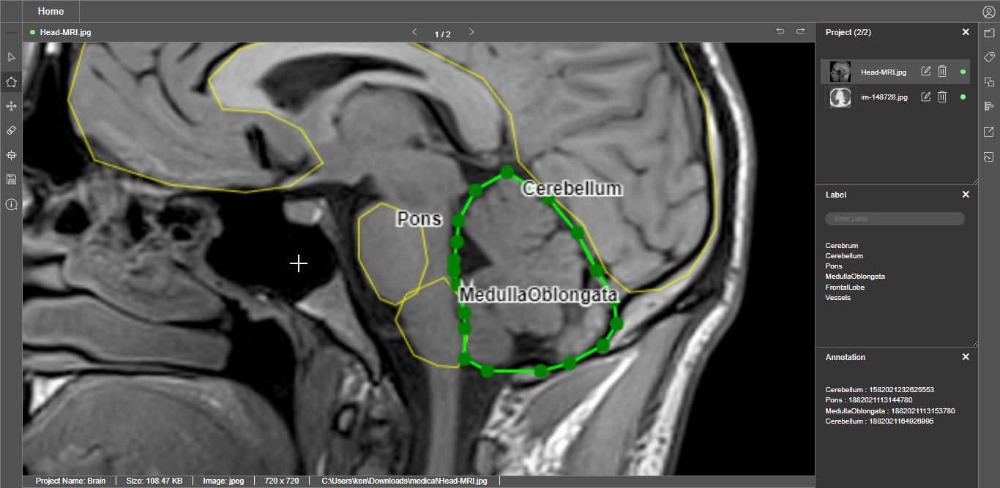

### 8. Fitting the Image

The fitting tool will center the image to the current workspace, it provides users an overview of the current image

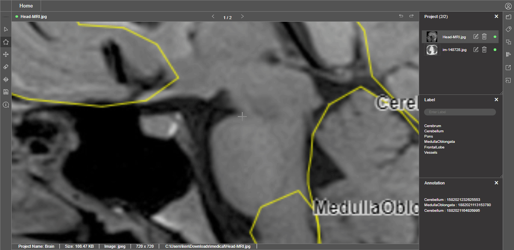

### 9. Shortcut Key

Users can utilize the available shortcut key to assist their annotation work. More information can check out the session below

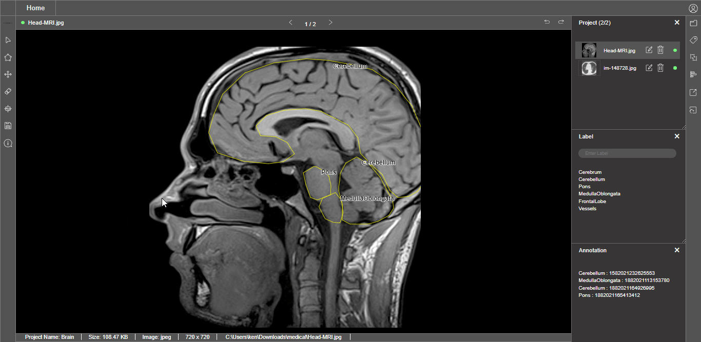



