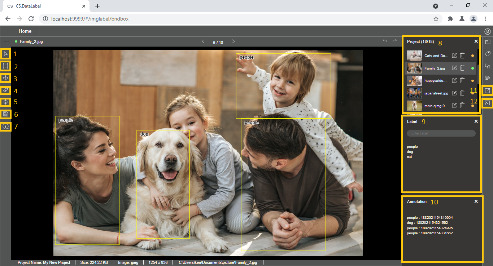

# Workspace Walkthrough

### 1. Pointer

To select, move image, and zoom in and out of the image

### 2. Annotating tool

To perform annotation. The functionality is different according to the feature selected. Example: Bounding box, Segmentation

### 3. Cross Guiding Lines

To turn on cross guiding lines that allow better visual positioning when annotating the objects of the current image

### 4. Eraser

To erase all the annotation on the current image

### 5. Fit Center

To show the full image by fitting into the workspace

### 6. Save

To save the annotation file in a different output format

### 7. Shortcut key

To show the available shortcut key that can use to ease the annotation work

### 8. Project Files

Listing all data points of the project/dataset folder

### 9. Label

List of labels created for the project

### 10. Annotation

List of annotations that have been made on the current image. It can be used to select an individual annotation on the image

### 11. Export

To export the project configuration file to the dataset folder

### 12. Reload

To refresh and update the current project when changes have been performed in the dataset folder


View more functionality in the [feature breakdown section](../feature-breakdown/)


