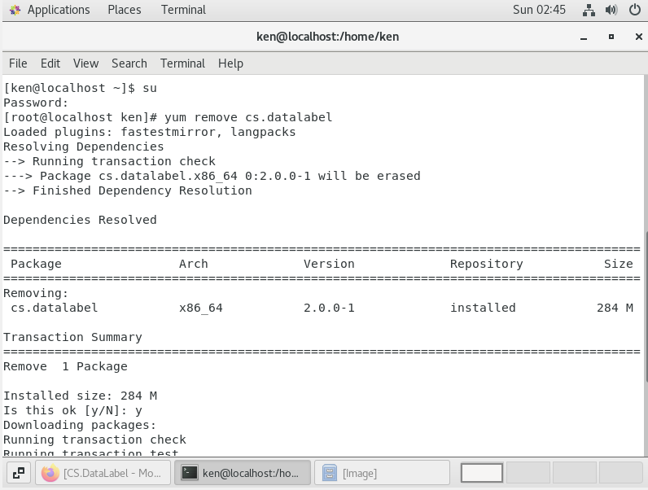
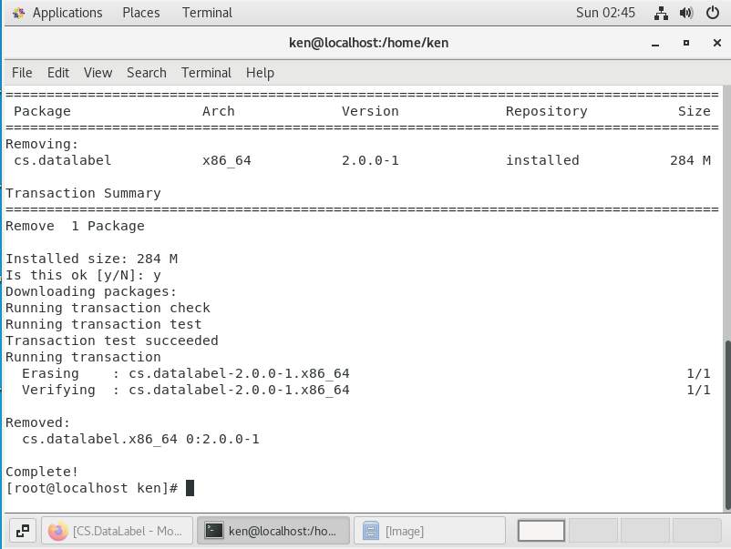
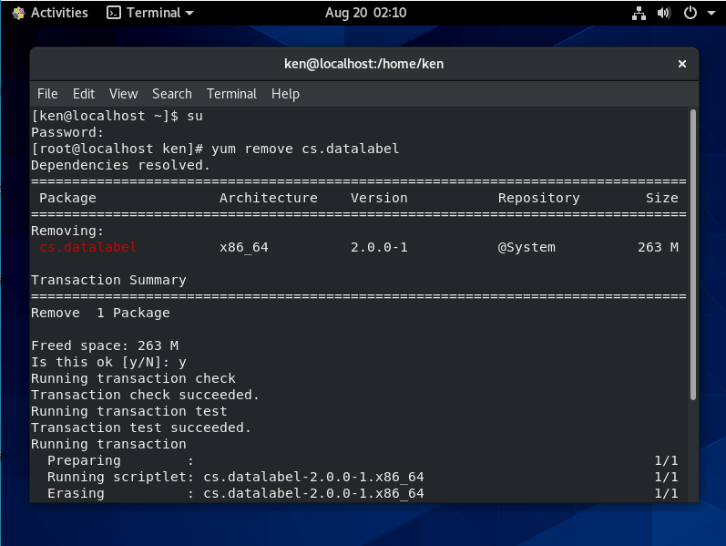
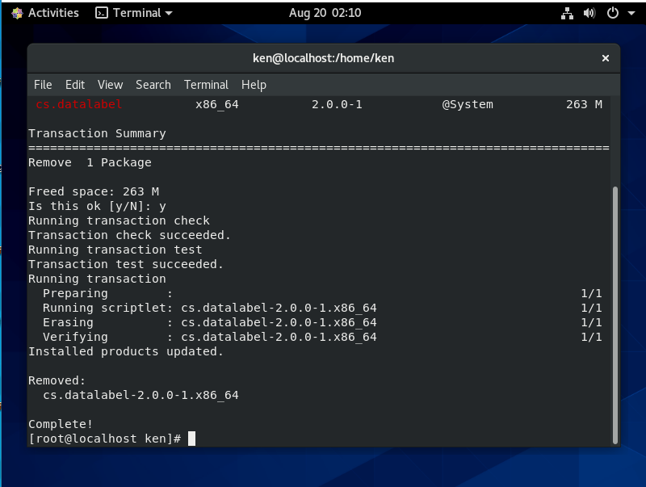

# Uninstallation on CentOS

## CentOS7

### Uninstall using terminal

Open the terminal, and follow the steps below.

**Step 1:** Change the user account to root account by typing the following command

```text
su
```

**Step 2:** Then, continue with the following command to uninstall the CS.DataLabel.

```text
yum remove cs.datalabel
```





## CentOS8

### Uninstall using terminal

Open the terminal and follow the structure below.

**Step 1:** Make sure the user account is the root account.

```text
su
```

**Step 2:** Continue by typing the following command.

```text
yum remove cs.datalabel
```





