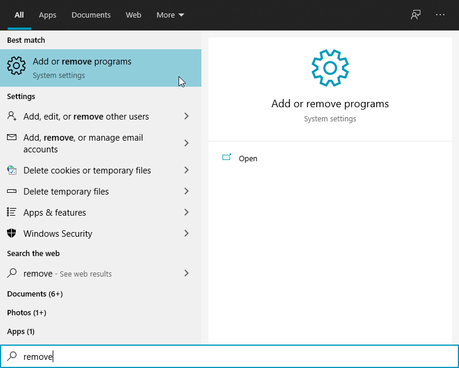

# Uninstallation on Windows

**Step 1:** Go to the search icon and type _remove._                                                                                                          **Step 2:** Then, click on the "Add or remove programs" button.

**Step 3:** Search cs.datalabel and click uninstall

\_\_

