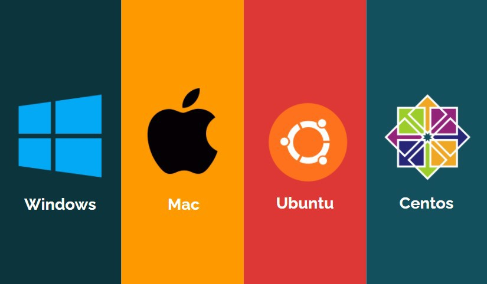

# Installation

## **Installation of Classifai**

Classifai supports the following operating systems \(OS\).

Installation comes in distribution built with Java for each operating system.

The versions supported for each OS and installation package format are listed below. Select accordingly to download the installation package.

| Operating System | Supported Version | Installation | Package | Format |
| :--- | :--- | :--- | :--- | :--- |
| [Windows](https://bit.ly/3xMayat) | 7, 8, 10 | msi |  |  |
| [Mac](https://bit.ly/3zObcpJ) | 10 | pkg |  |  |
| Ubuntu | [18 LTS](https://bit.ly/3gJZPY7), [20 LTS](https://bit.ly/3gSgd7Y) | deb |  |  |
| Centos | [7](https://bit.ly/3gJ7S7J), [8](https://bit.ly/3xUmOWv) | rpm |  |  |

Installation on Mac /product/installation/installation-on-mac

Installation on Ubuntu /product/installation/install-on-mac

Installation on Centos /product/installation/install-on-centos

Uberjar file: [Here](https://bit.ly/3xHTpP6)

Installation on Windows /product/installation/install-on-windows

