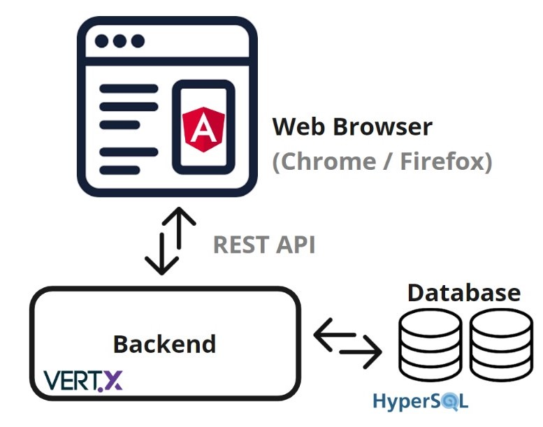

# Architecture Structure

**Classifai architectural diagram is as shown as below.** 

Classifai was build using Microservices architecture, with main components of 

* [Angular](https://angular.io/) as front-end web application platform
* [Eclipse Vert.x](https://vertx.io/) as backend server, and
* [HSQLDB](http://hsqldb.org/) as the Java In-Memory database.

Classifai is structured to enable fast and asyncronous operations, with aesthetically appleasing frontend and full functionalities to support labelling tasks.

