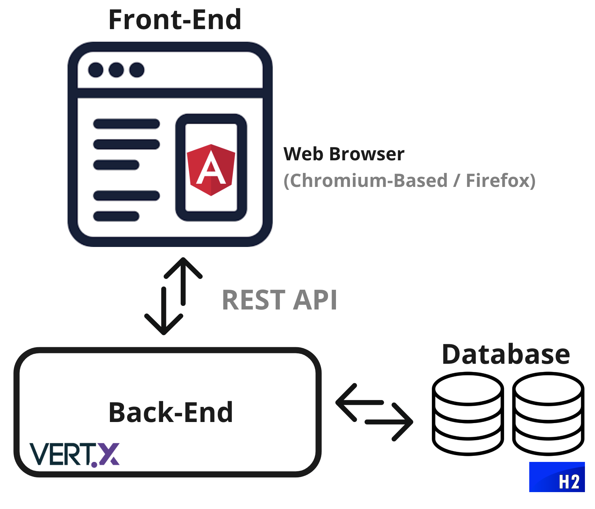

# Architecture Structure

**Classifai architectural diagram is as shown as below.** 

Classifai was build using Microservices architecture, with main components of 

* [Angular](https://angular.io/) as front-end web application platform
* [Eclipse Vert.x](https://vertx.io/) as backend server, and
* [H2](https://www.h2database.com/) as the Java In-Memory database. _Note :_ [_HSQLDB_](http://hsqldb.org/) _is used in_ [_Classifai V1_](https://docs.classifai.ai/development/architecture)_._

Classifai is structured to enable fast and asyncronous operations, with aesthetically appleasing frontend and full functionalities to support labelling tasks.

