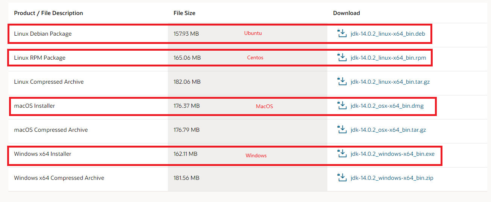
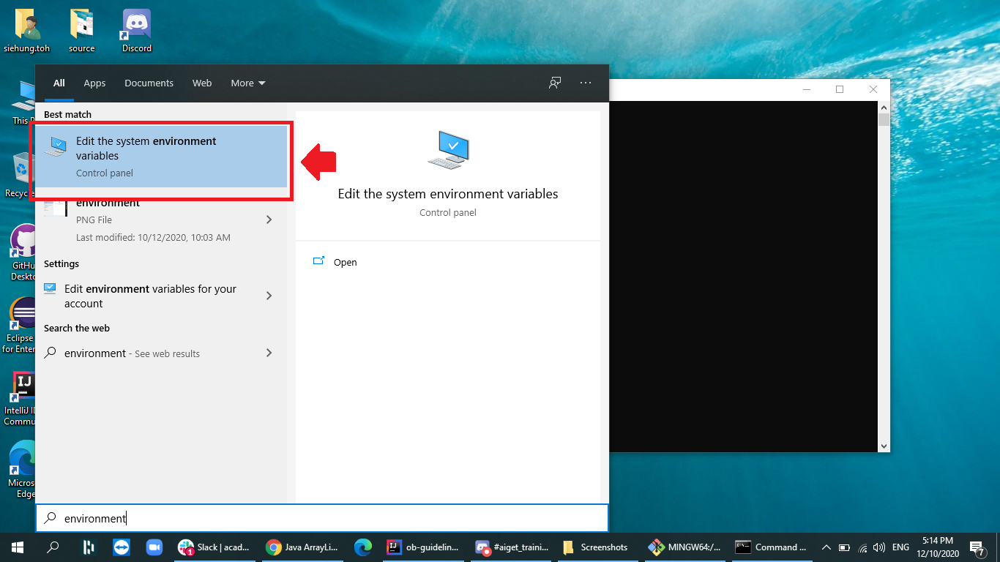
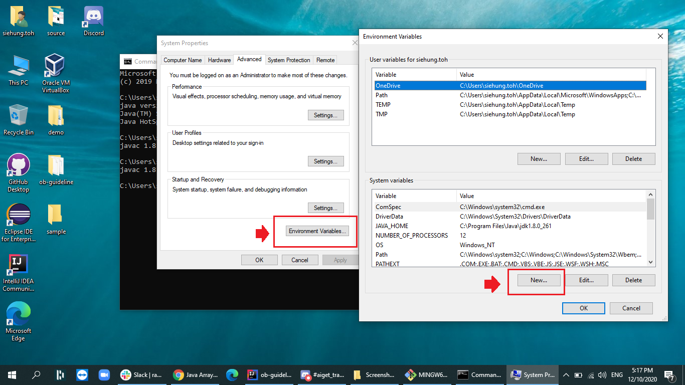
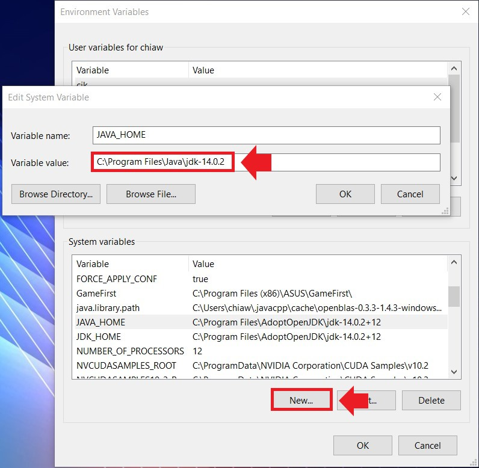
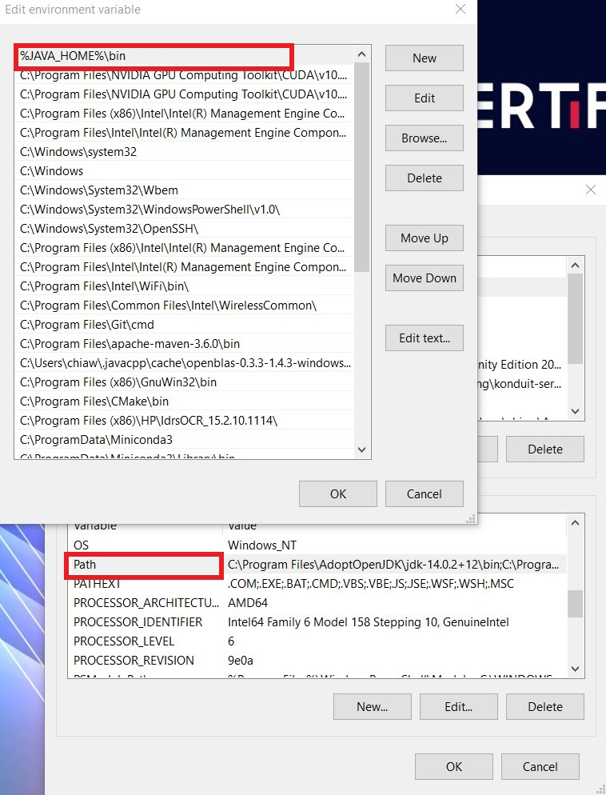
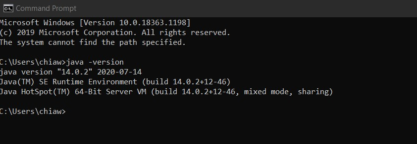
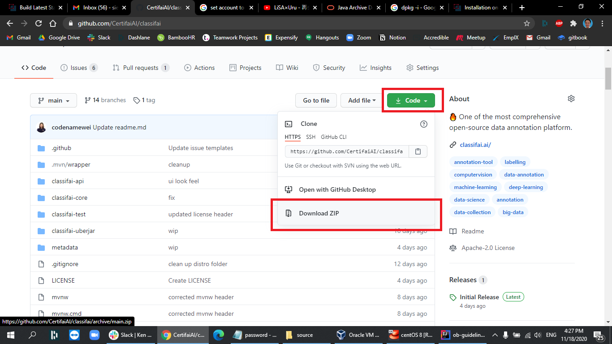
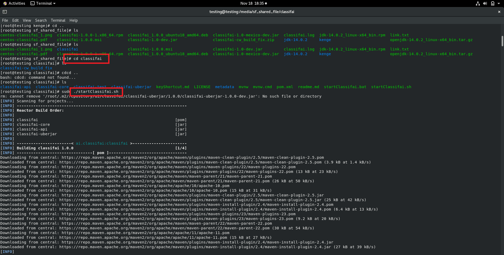

# Build Latest Stable Release of Classifai

Use can choose to build classifai straight from the source repository for scenarios such as  
1. Installer available currently does not support the respective operating system  
2. Get the latest development of Classifai Tool.  
  
There are three main steps to be performed:

1. Install Java JDK 14 \(Classifai runs on JDK 14\)
2. Clone / Download the [classifai repository](https://github.com/CertifaiAI/classifai)
3. Build Classifai

Below are the guidelines for user to build the Classifai tool from the source code.

## Install Java JDK 14

### 1.0 Install JDK 14

**Step 1:** Before downloading Classifai from Github, users required to install JDK 14. Go to [Oracle Official Website](https://www.oracle.com/java/technologies/javase/jdk14-archive-downloads.html) and find the JDK 14 versions installer. Register an account and sign in to download the JDK 14. 

Choose installer file accordingly to operating system.



**Step 2:** After the file is downloaded, install the JDK 14 installer.   
For **Centos** open terminal and install JDK with command:

```text
rpm -i package.rpm
```

For **Ubuntu Linux**, use 

```text
sudo dpkg -i package.deb
```

**Step 3:** To verify if installation is success, open a new window of terminal/command prompt and type the following command

```text
java -version
```

If terminal/command prompt shows the java version, then it means user has installed successful. 


For **Windows** user, there are a few more steps to configure the path if java version do not show out.

Go to Windows _Start_ and types _Environment_. Click _Edit the Environment Variable_. 



**Step 4**: Click _Environment Variables_ and find System Variable. 



**Step 5**: If can't find the Variable Name **JAVA\_HOME**, click _New_ and create a new variable. Set Variable name as **JAVA\_HOME** and set variable value as JDK version path. _For example: C:\Program Files\Java\jdk14_.   
  
**Note: Do not include bin directory as the path for the variable value.** 



**Step 6**: After that, find the variable name _Path_ and click _edit_. Go to _New_ and add a new variable path as name as **%JAVA\_HOME%\bin**. 



**Step 7**: Click _OK_ and restart the command prompt. Check again if successfully configured with the command below:

```text
java -version
```



### 2.0 Clone / Download the Classifai Repository

**Step 8:** Now, it's time to download latest Classifai release version from [here](https://github.com/CertifaiAI/classifai). Download the zip file. Alternatively, use the following command if you are familiar with git commands.

```text
git clone https://github.com/CertifaiAI/classifai.git
```

Extract the zip file and you are ready to build the Classifai uberjar file.



### 3.0 Build Classifai 

**Step 9:** Now, open the terminal/command prompt and navigate to the Classifai folder.

```text
cd {classifai-path}
```

#### Linux \(Centos, Ubuntu\), Mac

For linux users, switch to root account to prevent any permission problem.   
Build classifai using the command below: 

```text
sudo ./startClassifai.sh
```

#### Window

Use the command below

```text
startClassifai.bat
```

Successful running of the script file resulted in the the building of uberjar file.



Proceed to next subsection to see the instructions on how to run the jar file.



