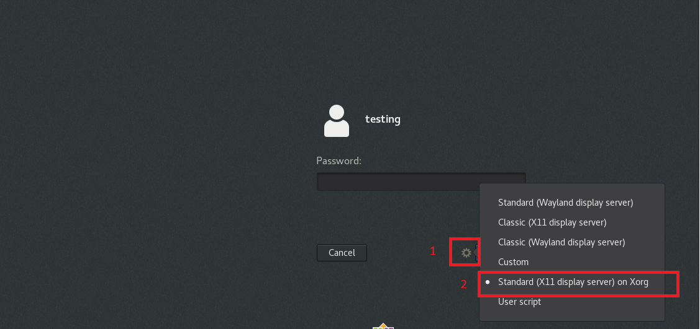

# Run Classifai from Uberjar

This is a continual from the previous section to run Classifai from the source repository. 

## Run Classifai from Uberjar Guideline

### 1.0 Set up the graphic environment \(Centos8 only\)

**Step 0:** Before log in to CentOS, click the setting button besides the Login button and select _Log in Standard \(X11 display server\) on Xorg_. 

Note: If use the default setting, user may face problems in launching the Classifai GUI with error can't connect to X11 window server with selected display variable. So, users are advised to set the environment to support X11 display server.



### 2.0 Go to classifai-uberjar subfolder

**Step 1:** Go to Terminal/Command Prompt, and navigate to the following folder.   
****  
**Windows**

```text
cd classifai-uberjar\target\
```

**Linux\(Centos, Ubuntu\), Mac**

For Linux user, users are advised to switch to root account.

```text
cd classifai/classifai-uberjar/target/
```


### 3.0 Run Jar file by using Java

Run the following command to start classifai:

```text
java -jar classifai-uberjar-1.0.0-dev.jar --unlockdb=true
```

**Reminder: Centos8 OS user might failed to open Classifai from Welcome Launcher. In that case, manually open firefox browser and go to** [http://localhost:9999](http://localhost:9999).


If faced any problems in the process, contact Classifai developers through [discord](https://discord.com/invite/WsBFgNP) to seek for assistance. 

