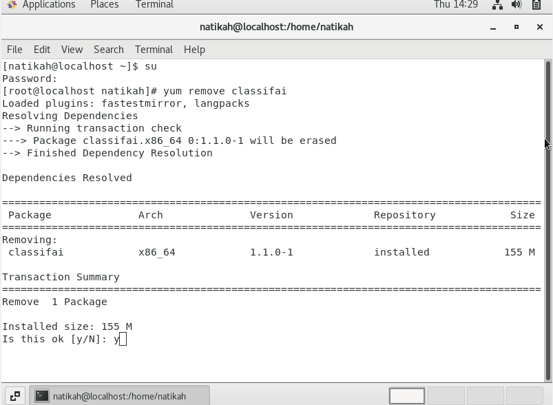
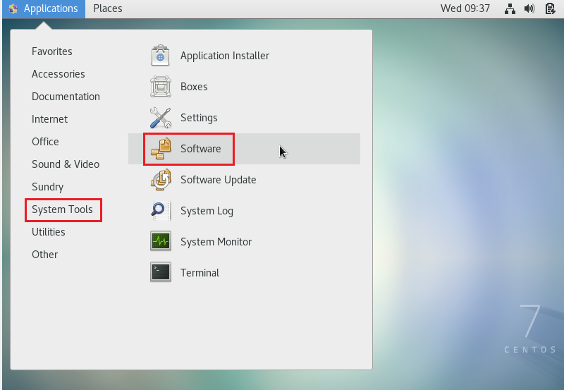
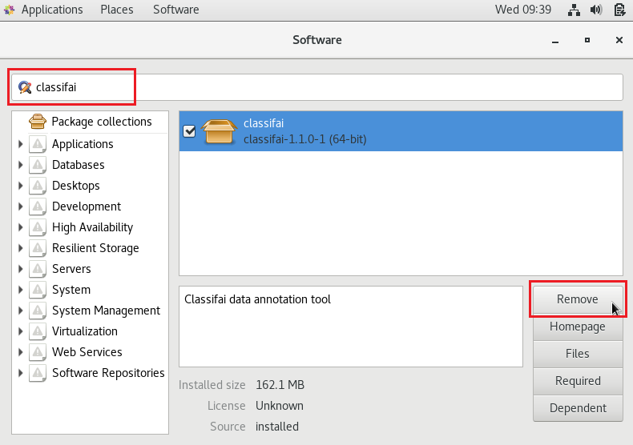
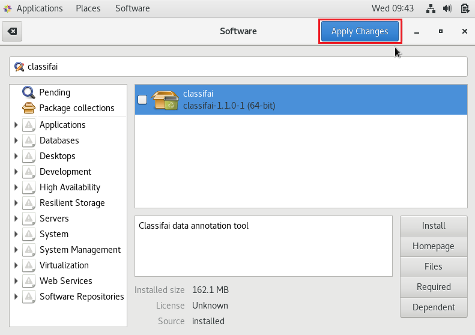
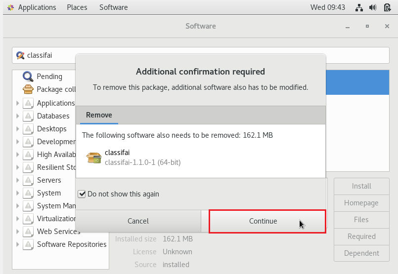

# Uninstallation on Centos 7

**Uninstall using terminal**                                                                                                                                         Open the terminal, and follow the structure below.

**Step 1:** Change the user account to root account by typing the following command

```text
su
```

**Step 2:** Then, continue with following command to uninstall the classifai.

```text
yum remove classifai
```



\*\*\*\*

**Uninstall ClassifAI on CentOS7                                                                                                                             Step 1:** Go to Applications, choose “System Tools” and click on the “Software” panel.



**Step 2:** Search for classifai package, then click on “remove” button.



**Step 3:** Then click on the “Apply Changes” button.



**Step 4:** Proceed by clicking on the “Continue” button.



\*\*\*\*

