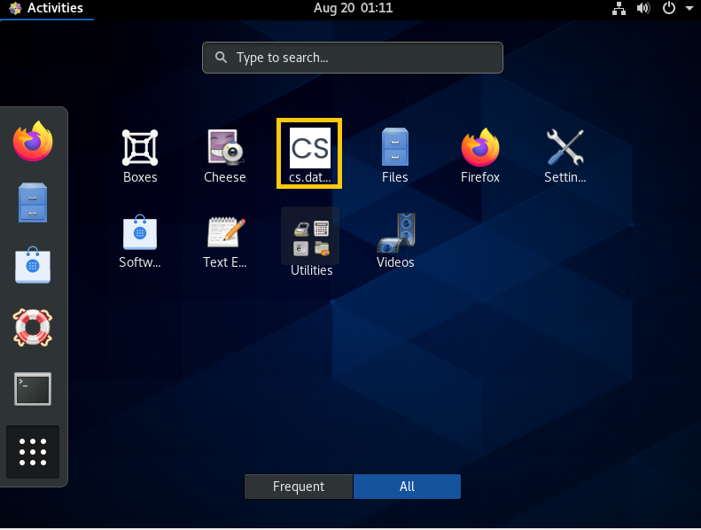

# Uninstallation on Centos 8

**Uninstall using terminal**                                                                                                                                                      Open the terminal and follow the structure below.

**Step 1:** Make sure the user account is the root account.

```text
su
```

**Step 2:** Continue by typing the following command.

```text
yum remove classifai
```


**Uninstall ClassifAI on CentOS8                                                                                                                              Step 1:** Go to Activities, and click on the "Software" icon.



**Step 2:** Then, click on the "Installed" button.


**Step 3:** Scroll down to find classifai application and click on the "Remove" button.  


**Step 4:** Confirm the uninstallation by clicking on the red "Remove" button.  ****


\*\*\*\*

