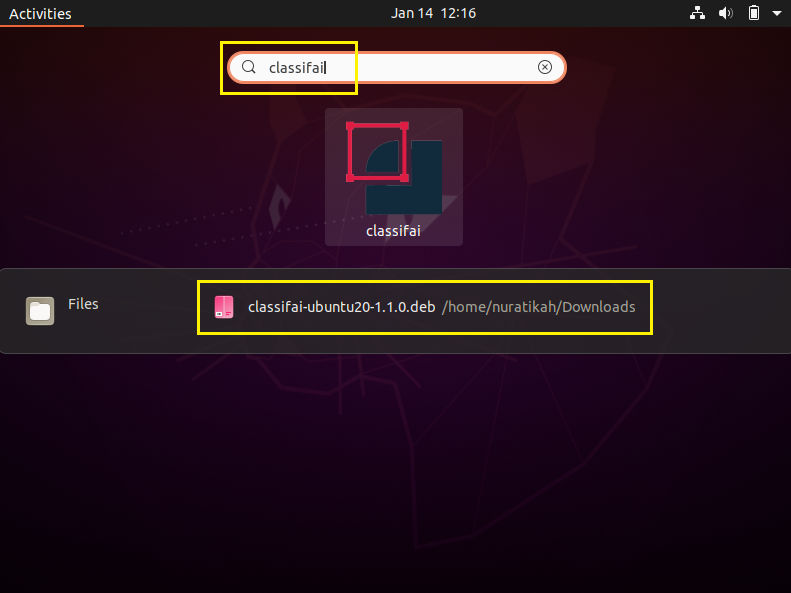
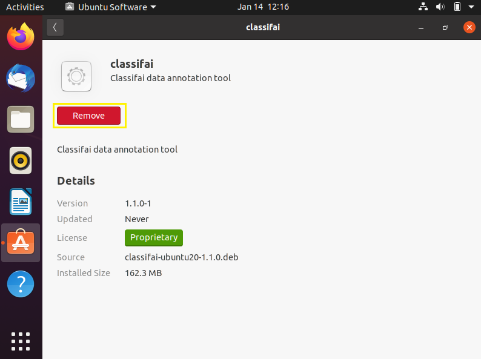
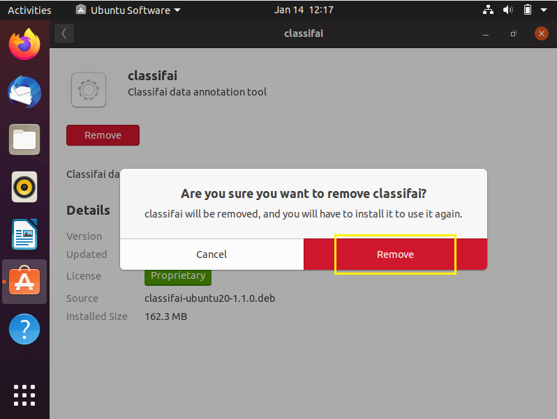

# Uninstallation on Ubuntu

**Method 1:** Uninstall using the terminal                                                                                                                                        Open the terminal and follow the following structure.

**Method 2:** Uninstall at Software Installer                                                                                                                       **Step 1:** Go to Activities panel.

**Step 2:** Search for classifai application, then click on the application repository.

**Step 3:** Click on the "Remove" button to uninstall.

**Step 4:** Confirm the uninstallation by clicking on the red "Remove" button.

