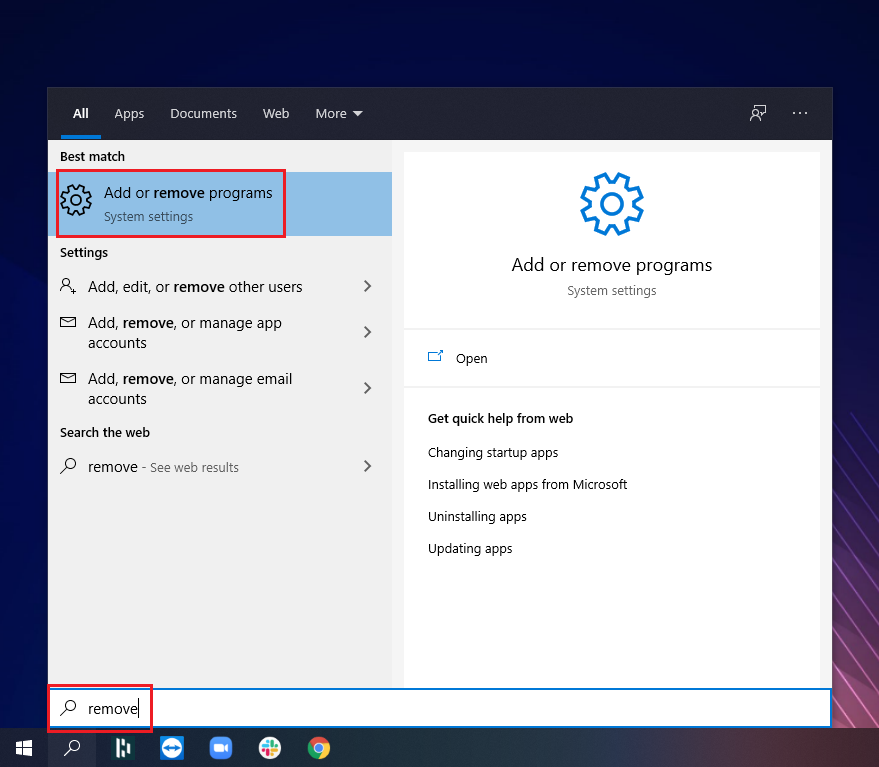
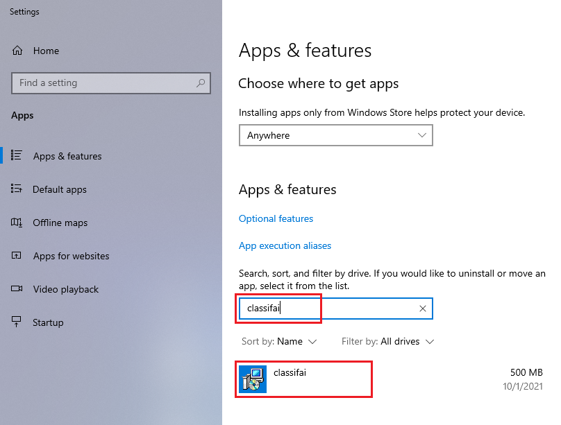
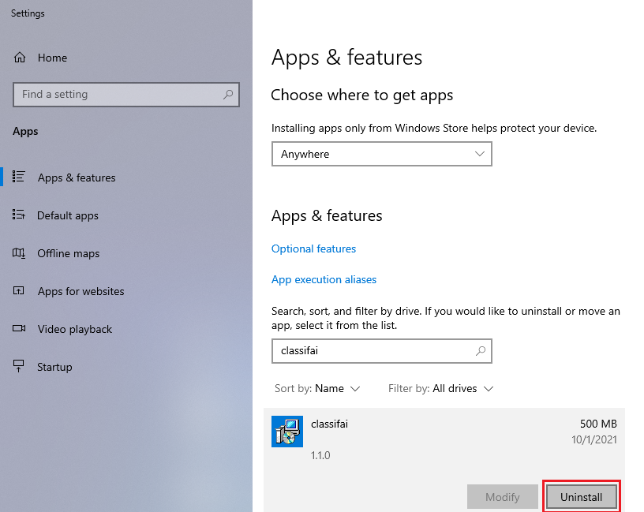

# Uninstallation on Windows

**Step 1:** Go to search icon and type _remove._                                                                                                          **Step 2:** Then, click on the "Add or remove programs" button.

**Step 3:** Search classifAI, and click the application.

**Step 4:** Click on the _Uninstall_ button that turn up.

