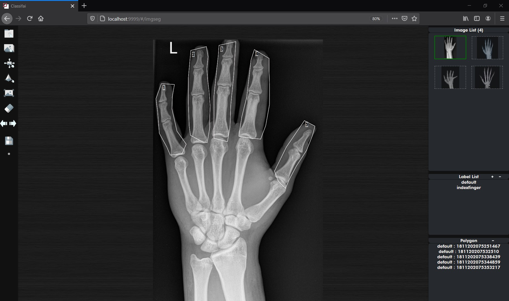
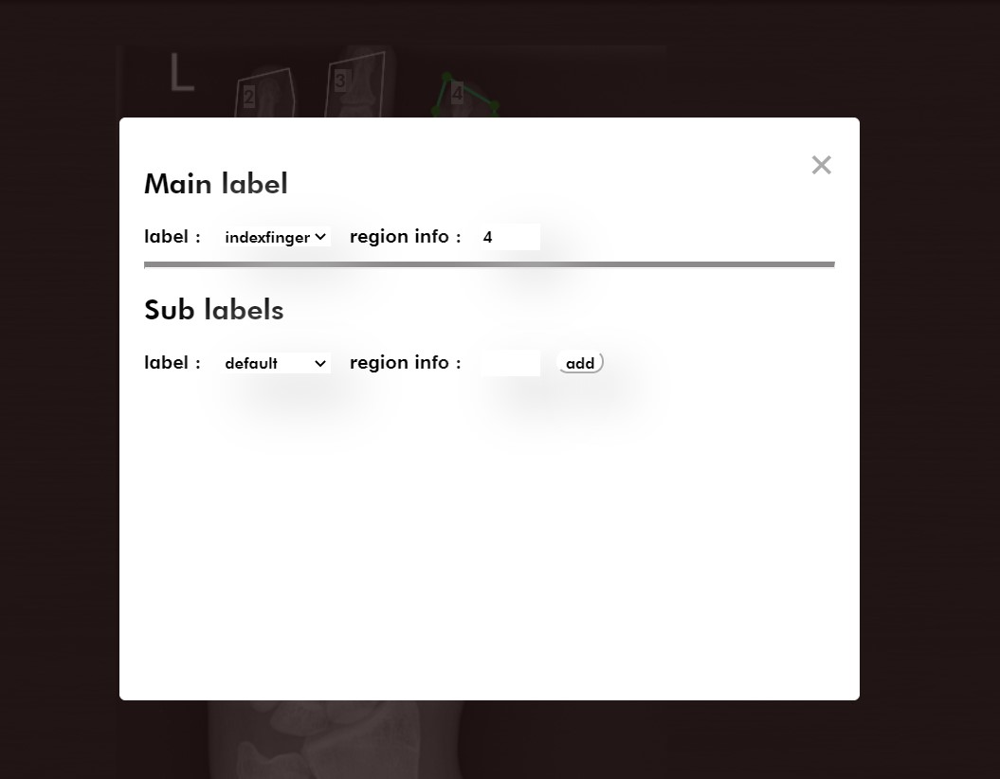
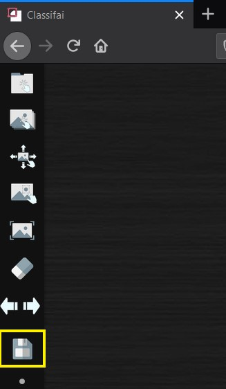
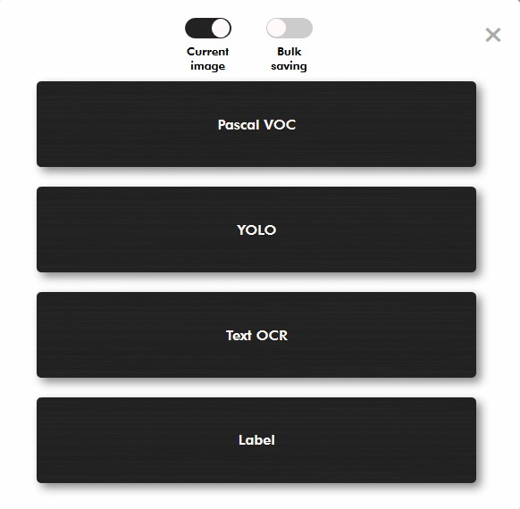

# Annotation For Different Use Cases

Classifai support various labellling methods for different use cases.

**Image Classification Labelling Method:**   
Draw a bounding box and select a label created from label list

**Text Recognition Labelling Method:**   
Draw a bounding box and insert text into the blank label column

**Segmentation labelling method:**   
Draw a polygon and assign labels created from the label list.

Create sub-labels if necessary. 

### **Export of Labels**

Annotation output has to be exported for latter process. The types of saved output format depends on the supported formats to train the labelled data with. 

Click on the file saving button to select types of output saving format. 

**Bounding Box Annotation**

Note: The option of saving label for current data point or the whole dataset is available for bounding box annotation. ****

**Segmentation Annotation**

