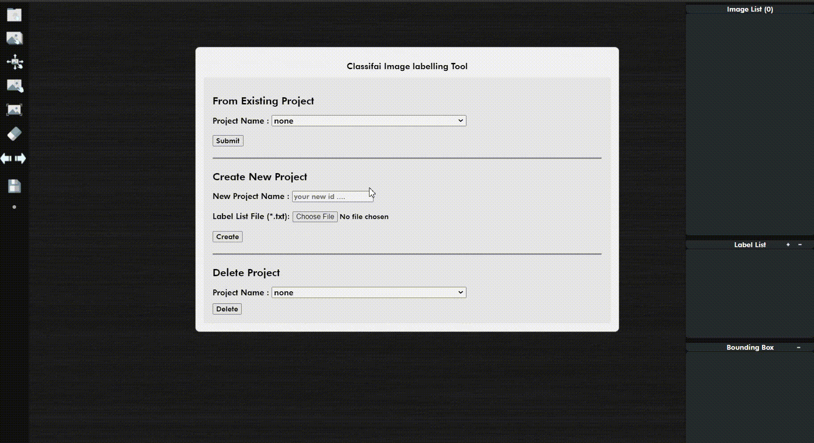
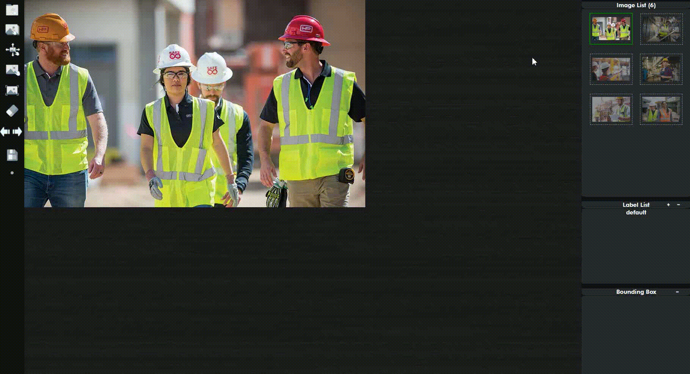

# Deletion of Projects/Data Points

**Deletion of Projects:**                                                                                                                                                             Unused projects can be deleted with a few clicks.  


**Note:** Deleted project will be removed from the database. It is unlikely to reverse the action. Proceed with care.


**Deletion of Data Points:**                                                                                                                                                Deleting selected images that have been imported by clicking on the top right corner \(image list panel\), and proceed by clicking on the delete button. 

Alternatively, tick on the **select all** checkbox to delete all images.


**Note:** Deleted images will be removed from the database. It is unlikely to reverse the action. Proceed with care.


                  ****

                                                                                       ****

                                                                     ****

