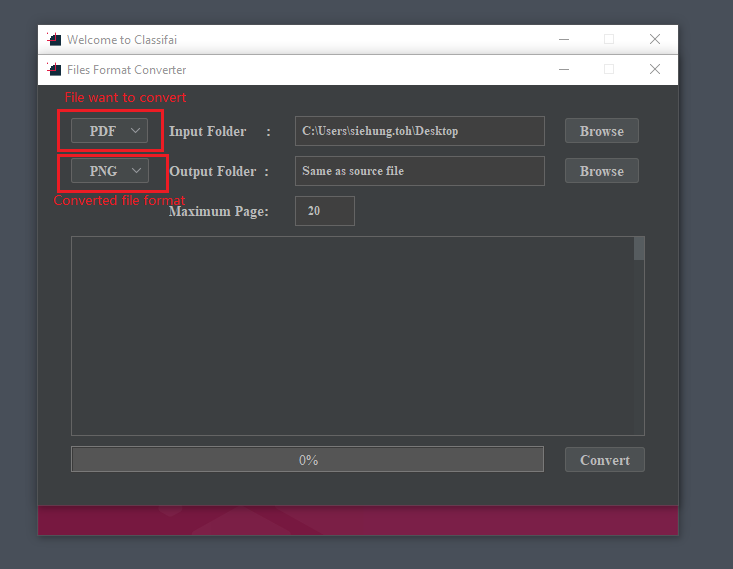

# Files Conversion

**Classifai** supports files conversion to ease the end users in labelling data in formats suitable for AI modelling. 

The motivation of this is there are formats which are not commonly use for data ingestion such as document formats \(doc, docx, pdf\) or image formats with more than 3 color channels \(tif, tiff\).

## 1.0 Supported File Format 

Files format below are supported for the conversion. User can choose accordingly from each category for the conversion of file format from one type to another.

#### File Format to Convert From

1. PDF
2. TIF

#### File Format to Convert To

1. JPG
2. PNG

Classifai team will continue to support more file types based on demands.

## 2.0 Files Conversion Guideline

**Step 1:** Run Classifai and click the medium button.

**Step 2:** On the top left side, a selection field beside Input folder is select the file format that user want to convert. A selection field beside Output folder is select the converted file format that user want.

**Step 3:** On the top right side, click the browser button to select input folder where the files to convert exist. 

Keep the output folder as it is \("Same as source file"\) to save the files back to the path where original files is. Alternatively, click on the second browser button for output folder to choose where does the user want to save the new converted files.

**Step 4:** Finally, click on the convert button in the bottom right corner. The progress bar will shows 100% when the files were successfully converted. Check the file names converted in the text pane. 

The Files Format Converter can be closed once the conversion complete.

**Step 5:** Go to the Output folder location can check the file that had been converted. 

 

 

