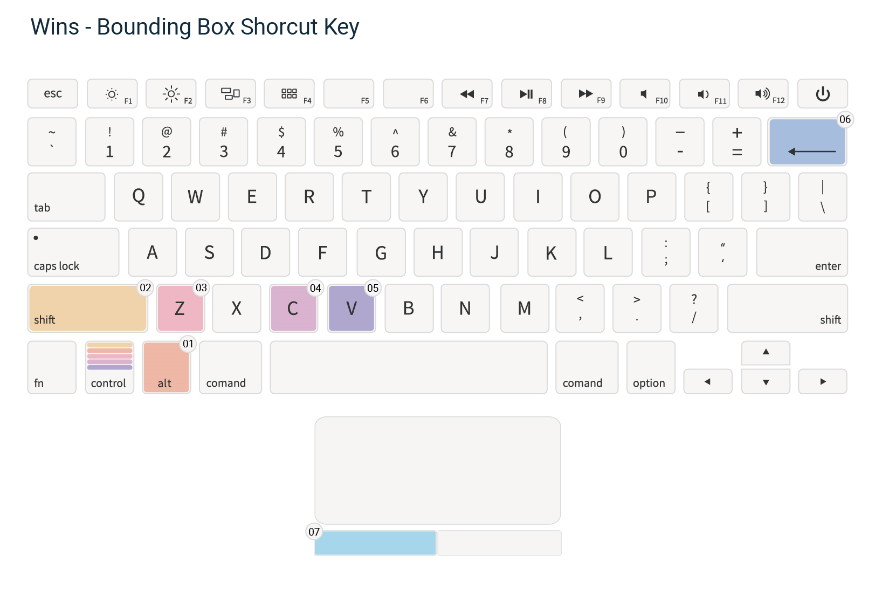
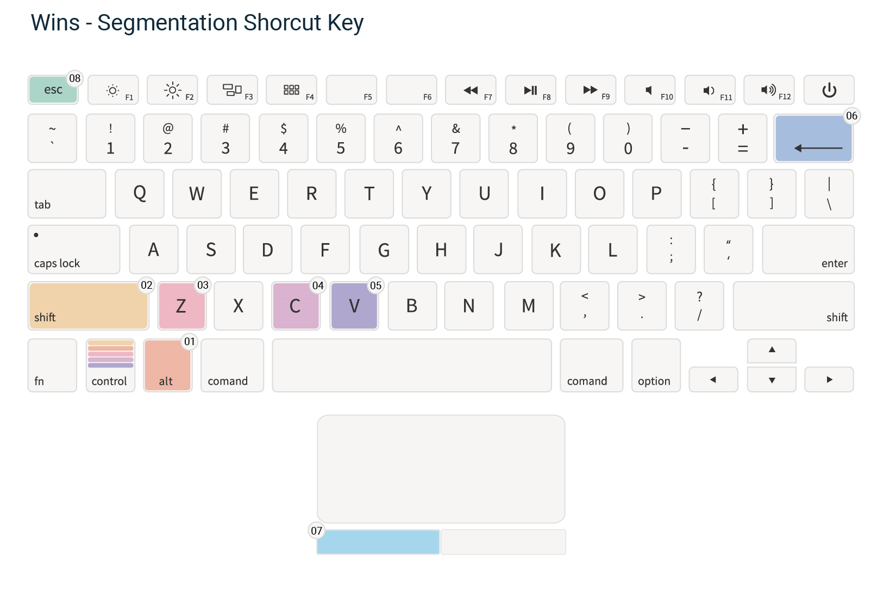

# Keyboard Shortcut

## Introduction

Shortcut keys are created to make the interface friendly for end users and speed up the annotation tasks. Refer to this page for the various shortcut keys.

## 1.0 Bounding Box

| No | Shortcut Key | Functionality |
| :--- | :---: | :---: |
| 1 | Ctrl/Command + z | Undo the last action |
| 2 | Ctrl/Command + Shift + z | Redo the last undone action |
| 3 | Ctrl/Command + c | Copy the selected bounding box |
| 4 | Ctrl/Command + v | Paste the selected bounding box |
| 5 | Delete/Backspace \(**With selected bounding box**\) | Delete a selected bounding box |
| 6 | Delete | Delete the current image |
| 7 | F2 | Rename the current image |
| 8 | Double click on a selected bounding box | Choose label for the selected bounding box |

## 2.0 Segmentation

| No | Shortcut Key | Functionality |
| :--- | :---: | :---: |
| 1 | Ctrl/Command + z | Undo the last action |
| 2 | Ctrl/Command + Shift + z | Redo the last undone action |
| 3 | Ctrl/Command + c | Copy the selected polygon |
| 4 | Ctrl/Command + v | Paste the selected polygon |
| 5 | Delete/Backspace \(**With selected polygon**\) | Delete a selected polygon |
| 6 | Delete | Delete the current image |
| 7 | F2 | Rename the current image |
| 8 | Double click on a selected polygon | Choose label for the selected bounding box |

