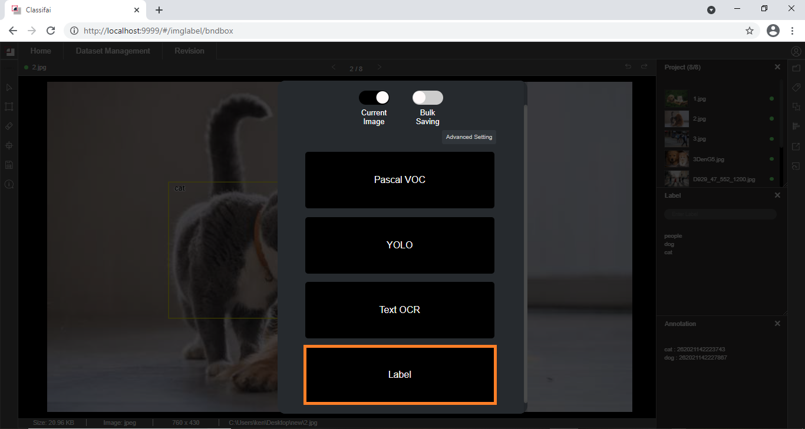

# Labels Import/Export

## Benefits of the Labels Import/Export Feature:

1\) Labels of images can be exported in different file formats such as **YOLO, Pascal VOC, text OCR, and text label.**  
2\) ****The exported label file \(.txt\) can be reimported into the project for usage, this speed up the labeling work task of similar kind of projects  
3\) Users can perform any kind of AI project at ease with the output from Classifai customizable labeling tool.   
4\) Users can choose to export the preferred file format for the current labeled image or all labeled images \(bulk saving\).


**The label file is recommended to be exported from the project rather than generated separately by the user. This is to prevent formatting errors from happening**


## Method

### How to Export Label File:

Click the save button on the annotation page and choose Label option to export the image labels of a project. The exported label file will be located in the project folder.

### How to Import Label File:

To reuse the labels for image annotation, import the label text file from the project folder.

