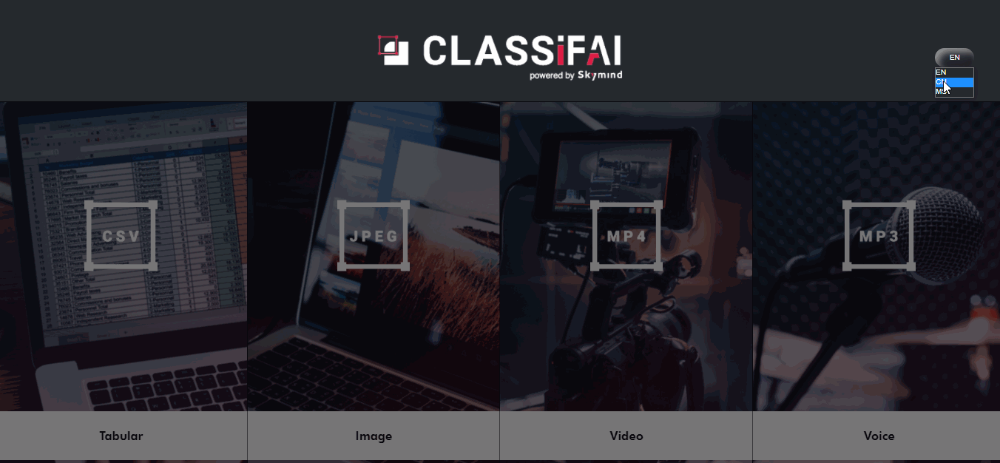

# Multi Languages Support

Classifai supports languages listed below to provide a customised workspace suited to every individual.

**Languages Supported**

* English \(default\)
* Malay Language
* Mandarin

Change to your preferable language of choice by toggling the selection on the top right corner of the home interface.


If you have a language of choice to suggest to the tool or would like to report any unfit words, do file an issue on [Classifai Github repository](https://github.com/CertifaiAI/classifai/issues). 


