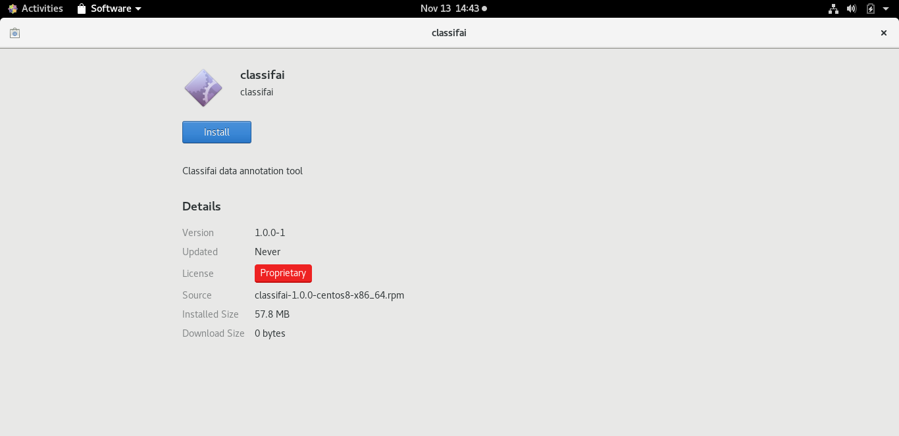
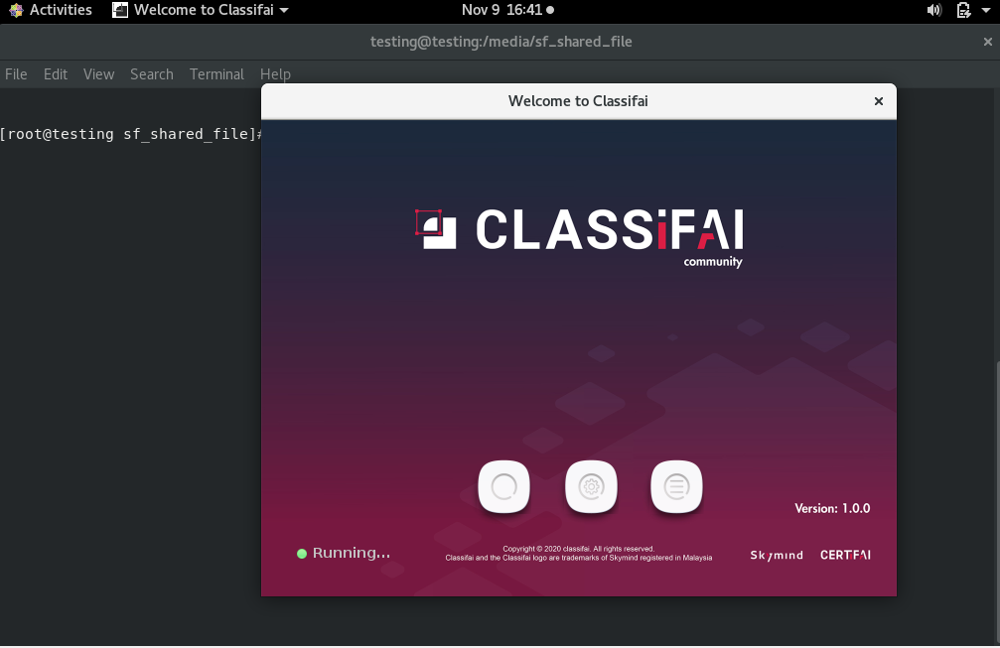

# Installation on Centos

## Installation for CentOS 7

For CentOS 7 , users have to install Classifai by using terminal.


Using GUI is not recommended because the installation might not run successfully. Don't worry,  the installation using terminal will just take a few steps to complete. 


**Step 1:** Download Classifai installer .rpm file compatible to CentOS 7 from the installation page. 



**Step 2:** Open terminal and go to the downloaded file location by command code: 

```text
cd {installer_location}
```

**Step 3:** Type the following command code to install Classifai. 

```text
 sudo rpm -i package_file.rpm
```


## Installation for CentOS 8

These are 2 methods to install Classifai on CentOS 8. Users can choose either using Software Installer \(GUI\) or using terminal.

### Method 1: Installation using Software Installer \(GUI\)

**Step 1:** Download Classifai installer .rpm file compatible to CentOS 8 from the installation page.



**Step 2:** Double click on the installer. Click install and wait for installation to complete.



### Method 2: Installation using Terminal

**Step 0:** Before login to the centos account, make sure Centos supported X11 server. User can click the setting icon and choose _standard._


**Step 1:** Download Classifai installer .rpm file compatible to CentOS 8 from the installation page. 



**Step 2:** Open terminal and navigate to the downloaded path using command below:

```text
 cd {installer_location}
```

Make sure the user account is root account using the command below:

```text
su 
```


**Step 3:** Type the following command code to install Classifai:

```text
 sudo rpm -i package_file.rpm
```


### Running of Classifai on CentOS

Search for Classifai program in the Applications / Activities.


Run by double clicking on the Classifai icon.







