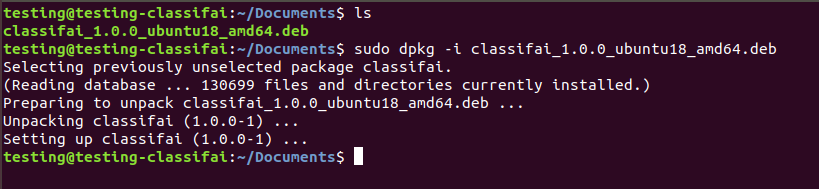

# Installation on Ubuntu

These are 2 methods to install Classifai in Ubuntu   
  
For those who familiar with terminal, users can using **method 1.**  
For those users who familiar with using Software Installer \(GUI\), go for **method 2**. 

### Method 1: Installation using Terminal

**Step 1:** Download Classifai installer .deb file from the installation page.   
Choose the operating system according to operating system Ubuntu 18 LTS or 20 LTS.

**Step 2:** Right click to open terminal and navigate to the downloaded file path.


```text
cd {downloaded_path}
```

**Step 3:** Type the following command code to install Classifai. 

```text
sudo dpkg -i package_file.deb 
```



### Method 2: Installation using Software Installer

**Step 1:** Download Classifai installer .deb file from the installation page.   
Choose the operating system according to operating system Ubuntu 18 LTS or 20 LTS.

**Step 2:** Double click on the installer. Click install and wait for installation to complete.


### Running of Classifai on Ubuntu

After installation completed, open Classifai by double clicking on the icon.




