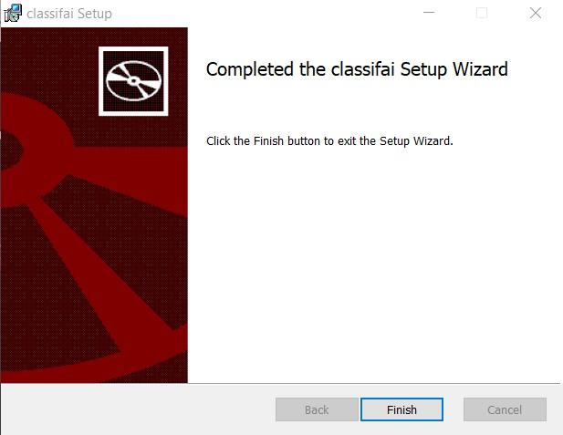

# Installation on Windows

**Step 1:** Download Classifai installer .msi file from the installation page. 



**Step 2:** Click installer .msi file to install Classifai.

Follow the instructions to go through the steps.

If the following window appear, click **run** to start the installation

**Step 3:** Wait till the installation completed.

**Step 4:** You will see Classifai icon on the desktop. Double click on it to start running Classifai.

**Note:** Installation package might fail to run if the computer was installed with antivirus program. If so, run the msi file from command prompt / powershell \(run with administrator mode\).   
  
Click the run button to proceed with installation.



