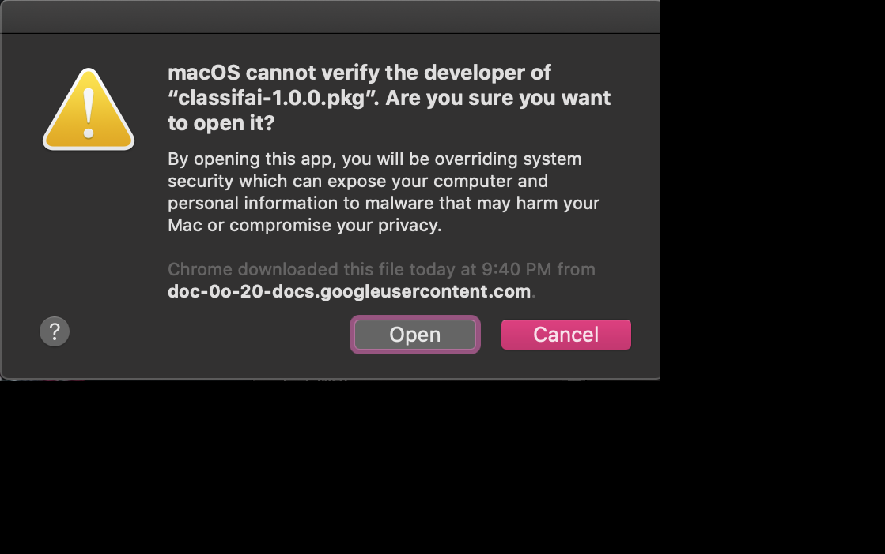
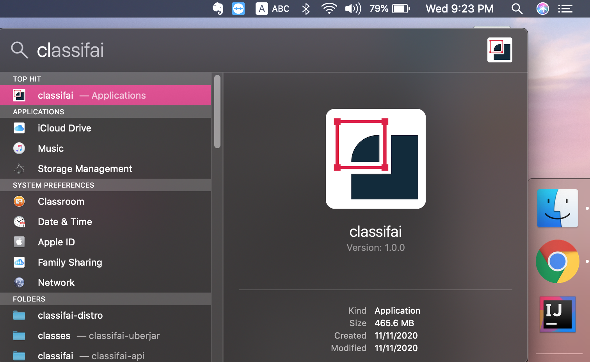

# Installation on Mac

**Step 1:** Download Classifai installer .pkg file from the installation page.



**Step 2:** Double click to install Classifai. Wait for installation to complete.


Package might failed to run with message as untrusted package.  
Workaround: [Here](https://truefire.zendesk.com/hc/en-us/articles/200200566-Open-Program-from-Unidentified-Developer-Mac-)


### Running of Classifai on Mac

After installation completed, open Classifai by double clicking on the icon.



