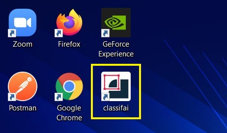
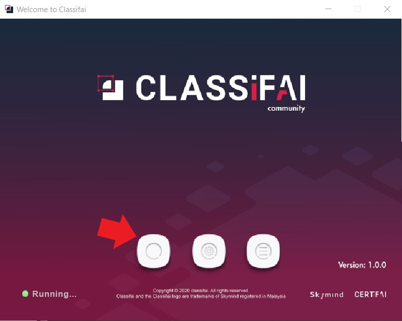
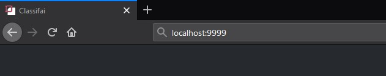

# Quickstart

After Classifai is installed, run it by clicking on the shortcut icon from respective operating system. 

Once Classifai is booted, Welcome Launcher will be launch. The server status will be displayed on the bottom left corner.

Once the server status message displayed "Running", Classifai is booted up successfully.

There are two ways to open classifai in the browser

* Click on the first button of **Welcome Launcher**

* Alternatively, proceed to open a supported browser \(Chrome, Firefox, or any Chromium-based browser\) and go to url [_http://localhost:9999/_](http://localhost:9999/)

