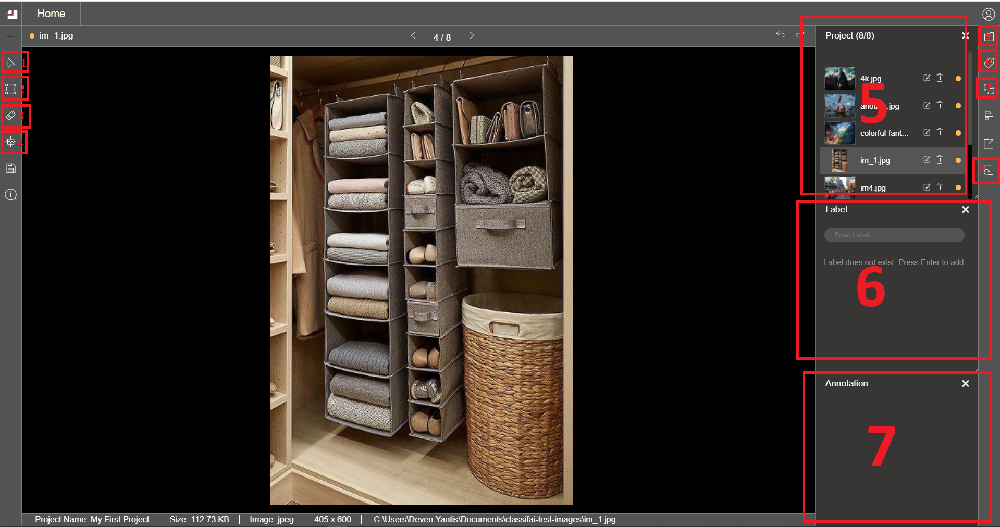

# Workspace Walkthrough

#### 1. Pointer

To select and move image.

#### 2. Annotating tool

To perform annotation. This functionality is different according to feature selected. Example: Bounding Box, Segmentation

#### 3. Eraser

To erase all annotation on current image.

#### 4. Fit Center

To show the full image by fitting into the workspace.

#### 5. Project Folder/Files

Listing all data points of the project/dataset folder.

#### 6. Label

List of labels created for the project

#### 7. Annotation

List of annotation made on the image. Can be used to select individual annotation.


View more functionality in the [feature breakdown section](../feature-breakdown/)


