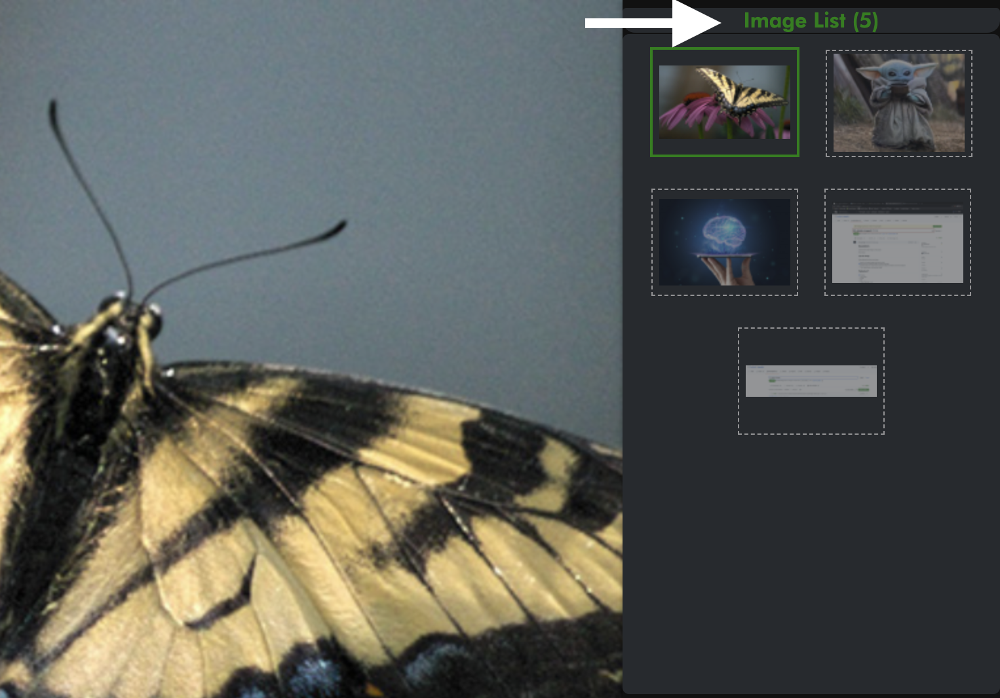
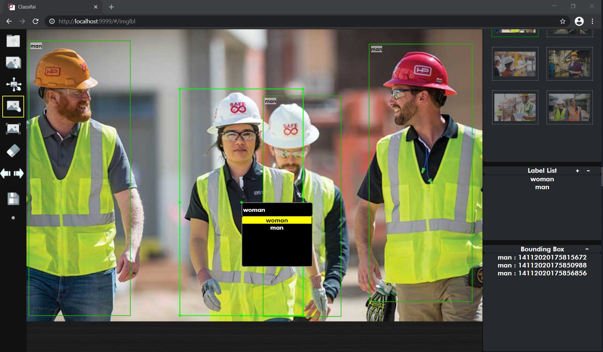
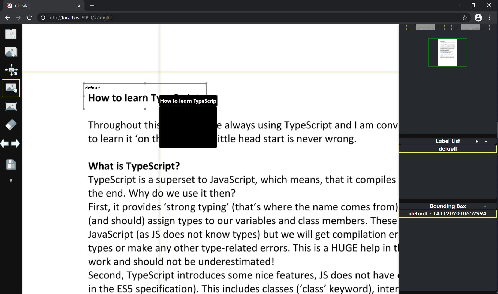

# Release Notes

## **Classifai 1.1.0**

_11 January 2021_

### **What's New:**

* Deletion of project
* Deletion of data points by clicking on the images panel.

1. Open window for deleting data points by clicking on the image panel 

    2. Proceed with deleting images

### **Bug Fixes:**

* When import an empty folder in the first release \(version 1.0.0\) , Classifai was on the loading status forever. It is no longer the case with [bug fix](https://github.com/CertifaiAI/classifai/pull/226) from [\#223](https://github.com/CertifaiAI/classifai/issues/223)

## Classifai 1.0.0

14 November 2020

**What's New:** 

* Initial release of data annotation tool to public!

**Major features:**

* Images Annotation with
  * **Bounding Box** 
    * Classic Image Classification Problem:
      * Create labels on the right panel and assign label to object of interest
    * Text Recognition Use Cases \(OCR\):
      * Text creation straight into the label box
  * **Polygons** \(Segmentation\)
* Conversion of files format for easy annotation 
  * PDF /TIF -&gt; JPG/PNG 
* Distribution ready for easy installation on different operating systems:
  * Windows \(7, 8, 10\)
  * Mac
  * Ubuntu \(18 LTS, 20 LTS\)
  * Centos \(7, 8\)

