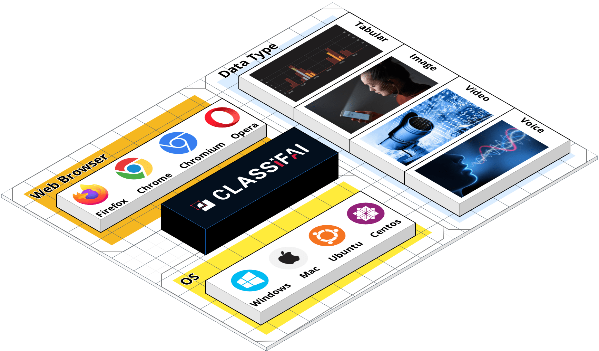
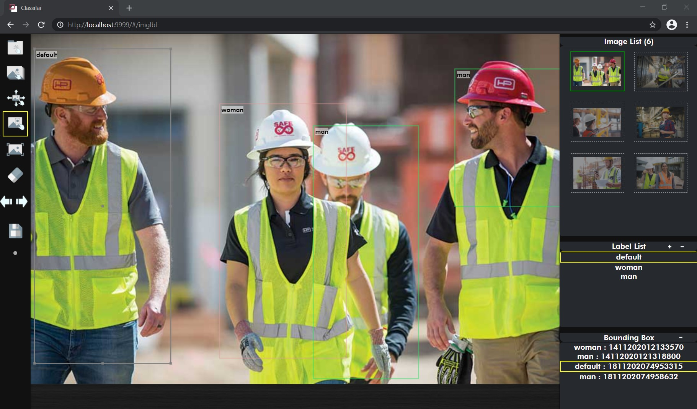

# Quick Tour

Classifai works on multiple operating systems \(**Windows, Ubuntu, Centos, Mac**\).  
Check out installation section for supported OS version and installation details.



After installation, it can be easily opened with [http://localhost:9999/](http://localhost:9999/) with supported web browsers such as **Firefox, Chrome as well as any Chromium based browsers.**

Diagram below shows an overview of Classifai environment

**Classifai** support **bounding box** and **segmentation** annotation for now.

**Bounding Box Annotation**

#### **Segmentation Annotation**



