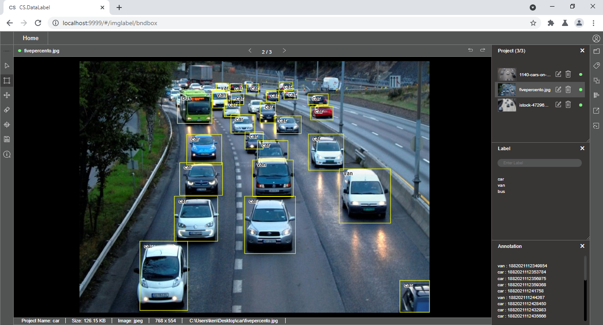

# Quick Tour

CS.DataLabel works on multiple operating systems. Check out the installation section for the supported OS version and installation details



After installation, CS.DataLabel can be easily opened with [http://localhost:9999/ ](http://localhost:9999/%20)with supported web browsers \(**Firefox, Chrome as well as any Chromium-based browsers\)**

CS.DataLabel supports bounding box annotation and segmentation annotation

### Bounding Box Annotation

### Segmentation Annotation

